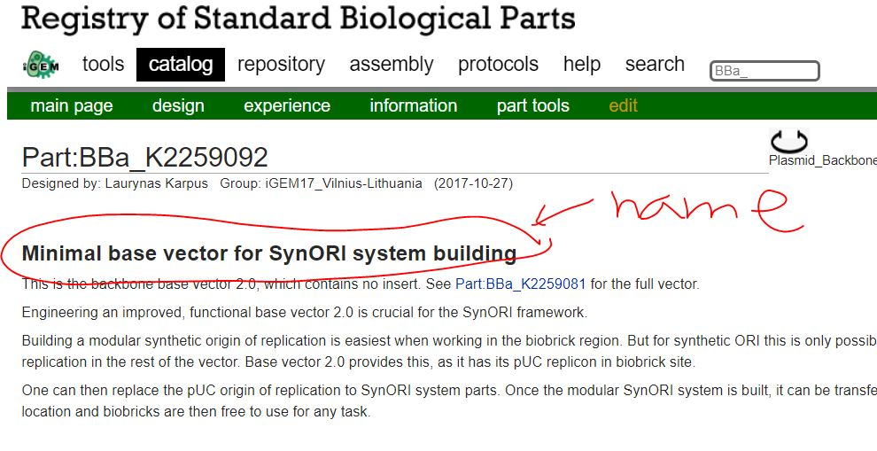
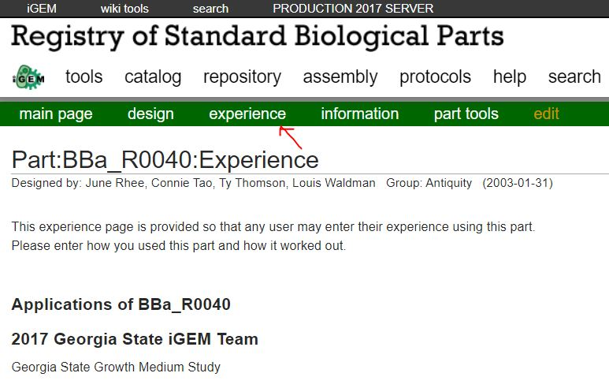

# List of students {.unnumbered}

```{r, echo=F}

std_name <- c("김승화", "김태현", "박성군", "Aporva", "Georgii", "유병현", "오석진", "허성보", "이진주")
std_email <- c('hayleykim97@kribb.re.kr', 'tete310@kribb.re.kr', 'tjdrns27@kribb.re.kr', 'aporva03@gmail.com',  'sdswpe@gmail.com', 'yoobh256@naver.com', 'dhtjrwls95@naver.com', 'ljj9322@naver.com', 'hsb@kribb.re.kr')
std_aff <- rep("합성생물학전문연구단", length(std_name))
std_acc <- c("user02 / userpass02",
             "user03 / userpass03",
             "user04 / userpass04",
             "user05 / userpass05",
             "user06 / userpass06",
             "user07 / userpass07",
             "user08 / userpass08",
             "user09 / userpass09",
             "user10 / userpass10"
             )
std <- data.frame(std_name, std_acc, std_email, std_aff)
knitr::kable(std, format = "markdown")
```

# Introduction

### 연구동 세미나실 (2021.3.4. 목) {.unnumbered}

생물학이 물리, 화학 분야와 다른 점 중 하나는 그 대상이 너무 복잡하다는 것임. 합성생물학은 생물학에 공학의 개념을 도입하여 복잡한 생명현상의 원리를 실제 만들어가며 이해하려는 시도임. 공학에서의 대부분의 결과물이 그렇듯 합성생물학 연구는 실제 문제에 대한 해결책을 제시하기 위한 목적을 가지고 있음. 발견과 관찰에 기반한 전통적인 생물학 연구의 패러다임이 합성생물학을 통해 발명으로 전환되었다고 볼 수 있음. 본 현장실습에서는 합성생물학 발전의 원동력이 되었던 iGEM 사례 분석을 통해 다음 세 가지 목표로 수업을 진행함.

-   합성생물학 개념 정립
-   사용된 부품/회로들의 정량적 데이터 수집 및 재현성 분석
-   Rmarkdown/Rstudio 활용 능력 학습

```{r, fig.align="center", fig.cap=c("강의자료"), echo=FALSE}
#knitr::include_graphics("material/ResearchE-0304.pdf")
```

# Reproducability in Biology

### 연구동 소회의실 (2021.3.8. 화) {.unnumbered}

생물학에서 실험결과의 낮은 재현성은 생물학 연구의 발전을 저해하는 고질적인 문제임 [@begley2012raise]. 이는 생명체의 복잡성에서 기인한다고 볼 수 있으며 Rmarkdown의 철학 또한 이러한 재현성의 관점에서 해석할 수 있음. 다음은 이러한 Rmarkdown 철학과 필요성에 대한 영상임.

[Garrett Grolemund \| R Markdown The bigger picture \| RStudio (2019)](https://www.youtube.com/watch?v=s9aWmU0atlQ&ab_channel=RStudio){target="blank"}

Rmakrdown은 Rstudio의 강의를 [링크](https://rmarkdown.rstudio.com/lesson-1.html){target="blank"} 참고하며 Markdown은 Pandoc의 문법을 [링크](https://rmarkdown.rstudio.com/authoring_pandoc_markdown.html){target="blank"} 참고.

# Data collection - iGEM teams

### Remotemeeting (2021.3.11. 목) {.unnumbered}

Naver cloud 사용하려 했으나 연구원 정책상 클라우드 사용은 금지되어 있어서 활용 못 함. 우선 각자 개인 PC에 R/Rstudio 설치 요청. 추후 효과적인 자료 공유 방안 고민 필요.

[igem.org](igem.org) 에서 5\~10개 팀을 선정하고 각 팀의 이름, 위키페이지, 요약 등을 각자 자유롭게 작성하여 카톡으로 제출. 아래 리스트의 pdf 외 파일 타입은 다른 이름으로 저장하여 확인.

### 정리 파일 {.tabset}

#### 원본 {.unnumbered}

-   [2-2 iGEM Team 선정 박성군.pdf](material/210311/2-2%20iGEM%20Team%20선정%20박성군.pdf){target="blank"}
-   [210311 현장연구_김태현_210311_160543.pdf](material/210311/210311%20현장연구_김태현_210311_160543.pdf){target="blank"}
-   [210311 iGEM 팀 선정-이진주.hwp](material/210311/210311%20iGEM%20팀%20선정-이진주.hwp){target="blank"}
-   [iGEM 유병현.docx](material/210311/iGEM%20유병현.docx){target="blank"}
-   [iGEM_AporvaGupta.xlsx](material/210311/iGEM_AporvaGupta.xlsx){target="blank"}
-   [iGEM_Georgii.xlsx](material/210311/iGEM_Georgii.xlsx){target="blank"}
-   [igem_오석진.xlsx](material/210311/igem_오석진.xlsx){target="blank"}
-   [현장연구 E 210311 수업 김승화.hwp](material/210311/현장연구%20E%20210311%20수업%20김승화.hwp){target="blank"}
-   [iGEM_허성보.xlsx](material/210311/iGEM_허성보.xlsx){target="blank"}

#### 제출 pdf 20210311 {.unnumbered}

```{r, eval=T}
pdf_file_names <- dir(path = "material/210311/", pattern = "*.pdf")
print(pdf_file_names)
```

```{r, eval=F, fig.align="center", echo=FALSE, out.width="100%", out.height="400"}
knitr::include_graphics(paste0("material/210311/", pdf_file_names[1]))  
knitr::include_graphics(paste0("material/210311/", pdf_file_names[2]))  
knitr::include_graphics(paste0("material/210311/", pdf_file_names[3]))  
knitr::include_graphics(paste0("material/210311/", pdf_file_names[4]))  
knitr::include_graphics(paste0("material/210311/", pdf_file_names[5]))  
knitr::include_graphics(paste0("material/210311/", pdf_file_names[6]))  
knitr::include_graphics(paste0("material/210311/", pdf_file_names[7]))  
knitr::include_graphics(paste0("material/210311/", pdf_file_names[8]))
knitr::include_graphics(paste0("material/210311/", pdf_file_names[10])) 

```

------------------------------------------------------------------------

# Rmarkdown practice

### Remotemeeting (2021.3.15. 월) {.unnumbered}

### 목표 {.unnumbered}

-   각자 정리한 iGEM 정리한 테이블을 검토하고 공통적으로 선택한 team이 있을 경우 논의를 통해 조정
-   본인이 선택한 team에서 사용한 방법 이해
-   본인이 선택한 team에서 사용한 DNA 부품, 회로 정리
-   Rmarkdown, R 사용법 실습 (아래 참고)

### 할 일 {.unnumbered}

-   Rstudio 접속: <http://192.168.122.155:8787>
-   주어진 계정 (user02\~user10) 으로 로그인
-   프로젝트 생성, 프로젝트이름은 ResearchE-userxx
-   Markdown 연습 [링크](https://rmarkdown.rstudio.com/authoring_pandoc_markdown.html){target="blank"}
-   Rmakrdown 연습 [링크](https://rmarkdown.rstudio.com/lesson-1.html){target="blank"}
-   본인이 정리한 iGEM team과 다른 사람이 정리한 iGEM team 비교
-   각자 정리한 iGEM 정리한 테이블이 모두 다른 포멧, 내용이나 이를

### Appearance of HTML documents

<https://bookdown.org/yihui/rmarkdown/html-document.html#appearance-and-style>

### Data frame {.unnumbered}

데이터프레임 실습을 위해 다음과 같이 code chunk를 추가함 (Ctrl + Alt + i). 참고로 R 코드를 실행하는 것은 해당 코드에 커서를 위치시키고 창 오른쪽 상단 Run 아이콘을 클릭하거나 단축키 (Ctrl + Enter) 실행.

```{r}


## generate data

teamname <- rep(c("TeamA", "TeamB", "TeamA", "TeamB"), 10)
teamtopic <-  rep(c("TopicA", "TopicB", "TopicA", "TopicB"), 10)
teamprobms <-  rep(c("ProbA", "ProbA", "ProbA", "ProbA"), 10)

## generate a data.frame variable

teamdf <- data.frame(teamname, teamtopic, teamprobms)
teamdf


```

------------------------------------------------------------------------

# Rmarkdown practice cont.

### Remotemeeting (2021.3.18. 목) {.unnumbered}

-   [Remotemeeting 링크](https://www.remotemeeting.com/reservation/share/ff80808178117eb70178405d4c4a283f){target="_blank_"}
-   강좌용 GitHub web page <https://greendaygh.github.io/researchE2021/>

### 수업목표 {.unnumbered}

-   Rstudio 사용법, Rmarkdown 만드는 방법 익히기
-   iGEM 팀 정보 (part포함) 정리해서 html 리포트 만들기
-   리포트를 pdf로 만들어서 email 제출

## Rstudio 사용법 for Rmarkdown

Rstudio를 사용한 Rmarkdown 만드는 법을 익힙니다. Rstudio는 R언어 외에도 다양한 언어를 이용한 프로그래밍을 지원하며 Rstudio의 철학 중 하나는 Rmarkdown, shiny 등을 활용한 사람들과의 소통입니다. 각자 사용에 익숙해지길 바라며 주요 항목은 다음과 같습니다.

-   Rstudio를 활용한 파일 업로드 및 다운로드 방법
-   Rmarkdown 작성을 위한 Visual mode 활용
-   Visual model에서 이미지, 참고문헌[@Singh2020], 코드블럭 넣기

``` {.python}
a = 2
b = 3
c = a*b
```

## Data frame 실습

### Vector

vector는 R의 기본 데이터 구조입니다. numeric vector, logical vector, character vector 등 저장되는 값의 타입에 따라 크게 세가지로 나눌 수 있으며 `class()` 함수를 이용해서 값의 타입을 알아낼 수 있습니다. `Combine function`인 `c()`를 활용하여 만들며 값을 순차적으로 붙여갈 수 있습니다.

```{r}
v1 <- c(1, 2, 3, 4, 5)
v2 <- c("a", "b", "c", "d", "e")
class(v1)
class(v2)
```

### Data frame

데이터프레임은 매트릭스와 같은 형태로 컬럼 하나가 하나의 벡터 변수로서 각 변수들이 다른 모드의 값을 저장할 수 있습니다. \$ 기호를 이용하여 각 구성 변수를 참조할 수 있습니다. 컬럼 한 줄이 하나의 변수 이므로 새로운 변수도 컬럼 형태로 붙여 넣을 수 있습니다. 즉, 각 row는 샘플을 나타내고 각 column은 변수를 나타내며 각 변수들이 갖는 샘플의 개수 (row의 길이, vector 의 길이)는 같아야 합니다. R 기반의 데이터 분석에서는 가장 선호되는 데이터 타입이라고 볼 수 있습니다.

```{r}
v_df <- data.frame(v1, v2)
v_df
class(v_df)
```

```{r}
v3 <- c(121, 22, 31, 98, 45)
v4 <- c("teamA", "teamB", "teamC", "teamD", "teamE")
v_df <- data.frame(v1, v2, v3, v4)
v_df
```

## Create a html page

iGEM 팀 관련 내용 정리해서 rmarkdown으로 html 리포트를 만듭니다. 주로 정리할 내용은 다음과 같습니다.

-   팀이름
-   소속 조직
-   제목
-   분류
-   wiki page
-   해결하고자 하는 문제 (가능한 간단히)
-   주요 해결 방법 (가능한 간단히)
-   사용한 부품
-   vector map

## Create a pdf file

위에서 만든 rmarkdown 리포트를 pdf로 만들어서 제출합니다.

### 제출 pdf 파일 20210318 {.tabset}

#### 제출 pdf list 20210318 {.unnumbered}

```{r, eval=T}
pdf_file_names <- dir(path = "material/210318/", pattern = "*.pdf")
print(pdf_file_names)
```

------------------------------------------------------------------------

#### 제출 pdf 20210318 {.unnumbered}

```{r, eval=F, fig.align="center", echo=FALSE, out.width="100%", out.height="400"}
knitr::include_graphics(paste0("material/210318/", pdf_file_names[1]))  
knitr::include_graphics(paste0("material/210318/", pdf_file_names[2]))  
knitr::include_graphics(paste0("material/210318/", pdf_file_names[3]))  
knitr::include_graphics(paste0("material/210318/", pdf_file_names[4]))  
knitr::include_graphics(paste0("material/210318/", pdf_file_names[5]))  
knitr::include_graphics(paste0("material/210318/", pdf_file_names[6]))  
knitr::include_graphics(paste0("material/210318/", pdf_file_names[7]))  
knitr::include_graphics(paste0("material/210318/", pdf_file_names[8]))  

```

#### 제출 html 20210318 {.unnumbered}

[박성군](material/210318/iGEMpsg.html)

# Rmarkdown on the web

### Remotemeeting (2021.3.22. 월) {.unnumbered}

-   [Remotemeeting 링크](https://www.remotemeeting.com/reservation/share/2c908ad678114c4c01785595a4e231a8){target="_blank_"}

### 수업목표 {.unnumbered}

-   (계속) Rstudio 사용법, Rmarkdown 만드는 방법 익히기, Git 사용법 익히기
-   Github page 만들기
-   Github page 주소 이메일로 전달

## Create GitHub pages

GitHub에 webpage를 만드는 연습을 하겠습니다.

[github-page-rstudio.html](github-page-rstudio.html)

## GitHub page list

```{r, echo=F}

github.page <- c("https://hayleykim97.github.io/ResearchE/",
                 "https://th-kim310.github.io/ResearchE/",
                 "https://Lelp27.github.io/researchE/",
                 "https://aputron.github.io/researchE/",
                 "https://gpemelianov.github.io/researchE/",
                 "https://yoo-bh.github.io/researchE/",
                 "https://seokjin-oh.github.io/researchE/",
                 "https://treebird19.github.io/researchE/",
                 "https://JinjuLee119.github.com/JJ/"
                 )
std <- data.frame(std_name, std_email, github.page)
knitr::kable(std, format = "markdown")

```

# Rmarkdown on the web II

### 수업목표 (2021.3.25. 목) {.unnumbered}

-   (계속) Rstudio 사용법, Rmarkdown 만드는 방법 익히기, Git 사용법 익히기
-   새로운 프로젝트와 원격 저장소를 만들기 (지난 시간 복습)
-   Project Name: igemE (대소문자 구분)
-   새로 만든 Github page 주소 이메일로 전달

## Create a new GitHub repository with pages

-   GitHub 새로운 레포지토리 igemE 만들기
-   [github](https://github.com)에 로그인 후 Repository 생성
-   Public (README.md 생성 안 함) 옵션을 주고 완료

## Create a new project in Rstudio

-   Rstudio \> File \> New Project \> New Directory
-   New Project \> igemE 라는 이름으로 Directory name 입력 \> create project 클릭 (상위 디렉토리 위치 확인)

## Connect local project to GitHub repository

-   Rstudio \> Tools \> Version Control \> Project Setup \> Git/SVN 클릭
-   Version control system에서 git 선택 (Rstudio 재시작 할 수 있음)
-   Rstudio 화면에서 Terminal 텝 선택
-   terminal 1 역삼각형 클릭 `Go to current directory` 선택

### Local 저장소에 commit

        git add .
        git commit -m "init" 
        

### Remote 저장소와 연결

        git branch -M main
        git remote add origin https://github.com/greendaygh/igemE.git
        git push -u origin main

-   위에서 `greendaygh` 대신 본인 GitHub ID 입력

## GitHub page 생성

-   브라우저로 본인의 GitHub page 이동
-   Settings \> Options \> GitHub Pages 에서 Source를 Main branch로, foldedr는 /(root)로 설정 후 Save.

## 새로운 페이지 생성

-   Rstudio \> New File \> Markdown File

-   다음 입력 후 README.md로 저장

          This is readme markdown file

## 로컬, 리모트 저장소에 Commit 및 Push

-   Rstudio 상단 GIT 아이콘 \> Commit
-   또는 Ctrl + ALT + M
-   README.md 파일 Staged에 체크
-   오른쪽 Commit message에 "Upload README file" 이라고 입력 후 Commit 버튼 클릭
-   팝업창 Close 후 오른쪽 상단 Push 클릭
-   팝업창 Close 후 Git 창도 닫기

## 웹 페이지 확인

-   브라우저를 통해 리모트 레포지토리 확인 (greendaygh 대신 본인 아이디 입력)

         https://github.com/greendaygh/igemE/

-   README.md 파일 확인

-   브라우저 주소창에 다음 입력 (greendaygh 대신 본인 아이디 입력) 메세지 확인

          https://greendaygh.github.io/igemE/

# Rmarkdown on the web III

### 수업목표 (2021.3.29. 월) {.unnumbered}

-   (계속) Rstudio 사용법, Rmarkdown 만드는 방법 익히기, Git 사용법 익히기
-   지난 시간 만든 igemE (대소문자 구분) 페이지 만들기 계속 (완료하지 못 한 경우)
-   본인이 조사했던 igem team 및 part 정보를 2개 테이블 (iGEM_team, iGEM_part)로 만들어서 웹에 올리기

## igemE 페이지 완성

완료하지 못 한 학생의 경우 지난 시간 자료 참고해서 완성. 강사가 직접 다니며 검토 가능.

```{r, echo=F}

igeme.page <- c("https://hayleykim97.github.io/igemE/",
                 "https://th-kim310.github.io/igemE/",
                 "https://Lelp27.github.io/igemE/",
                 "https://aputron.github.io/igemE/",
                 "https://gpemelianov.github.io/igemE/",
                 "https://yoo-bh.github.io/igemE/",
                 "https://seokjin-oh.github.io/igemE/",
                 "https://treebird19.github.io/igemE/",
                 "https://JinjuLee119.github.com/igemE/"
                 )
std <- data.frame(std_name, igeme.page)
knitr::kable(std, format = "markdown")

```

## iGEM part Rmarkdown 페이지 만들기

-   igem_part.Rmd 라는 새로운 파일 생성
-   이 파일에 다음과 같은 형식으로 2개의 테이블 (iGEM_team, iGEM_part) 생성
-   완성 후 Knit 이용 html 페이지 생성

### iGEM_team 테이블

```{r, eval=F}
no <- c(1, 2)
team_name <- c("Queens-Canada", 
               "Tainan")
project_title <- c("Velcrion",
                   "Oh_My_Gut")
project_year <- c(2020, 
                  2019)
wiki_page <- c("https://2020.igem.org/Team:Queens_Canada",
               "https://2019.igem.org/Team:NCKU_Tainan")

igem_team <- data.frame(no, 
                        team_name, 
                        project_title, 
                        project_year, 
                        wiki_page)
#knitr::kable(std, format = "markdown")
knitr::kable(igem_team)
```

### iGEM_part 테이블

```{r}
no <- c(1, 2, 3)

part_id <- c("BBa_K2259000", 
             "BBa_K2259010",
             "BBa_K2259092")
part_name <- c("SynORI framework RNA II - Replication Initiator (Group A)",
               "Rop protein - global copy number inhibitor (SynORI framework)",
               "Minimal base vector for SynORI system building")
part_type <- c("Prject",
               "Coding",
               "Plasmid")
team_id <- c(2, 2, 2)

igem_part <- data.frame(no,
                        part_id, 
                        part_name,
                        part_type, 
                        team_id)

knitr::kable(igem_part)
```

part_name은 아래와 같이 part registry 페이지의 큰 글씨로된 타이틀이며 team_id는 앞서 iGEM_team 테이블의 해당팀의 no를 넣음.



## README.md 에 igem_part 파일 링크 생성 후 git에 업로드

-   README.md 파일에 다음 링크 생성

          [iGEM part](igem_part.html)

-   Git add 및 commit (Local repository)

-   Git push (Remote repository)

-   igemE 웹페이지 확인

# iGEM 부품 사용 사례 분석

-   [Remotemeeting 링크](https://www.remotemeeting.com/reservation/share/ff808081788431680178892794ec044e){target="_blank_"}
-   강좌용 GitHub web page <https://greendaygh.github.io/researchE2021/>

## 수업목표 (2021.4.01. 목)

-   지난 시간 만든 igemE (대소문자 구분) 페이지 만들기 완료 (완료하지 못 한 경우)
-   igem에서 사용된 promoter 10종에 대해서 [Most_Used_Promoters](http://parts.igem.org/cgi/partsdb/pgroup.cgi?pgroup=most_used_promoters) 각자 할당된 프로모터에 대해서 1개 experience (igem 팀사례) 분석
-   프로모터의 정량적 특성을 파악하기 위해 해당 프로모터에 의해서 형광 또는 발색 Reporter가 발현하는 사례를 위주로 탐색하고 정리

## igemE 페이지 및 할당 프로모터

```{r, eval=T}
igeme.page <- c("https://hayleykim97.github.io/igemE/",
                 "https://th-kim310.github.io/igemE/",
                 "https://Lelp27.github.io/igemE/",
                 "https://aputron.github.io/igemE/",
                 "https://gpemelianov.github.io/igemE/",
                 "https://yoo-bh.github.io/igemE/",
                 "https://seokjin-oh.github.io/igemE/",
                 "https://treebird19.github.io/igemE/",
                 "https://jinjulee119.github.io/igemE2/"
                 )
promoters <- c("BBa_R0040", "BBa_R0010", "BBa_J23100",
               "BBa_R0011", "BBa_I0500", "BBa_J23101",
               "BBa_R0051", "BBa_J23119", "BBa_R0062")
std <- data.frame(std_name, igeme.page, promoters)
knitr::kable(std, format = "markdown")

```

## create Promoter.Rmd file

새로운 Promoter.Rmd 파일을 만들고 할당된 프로모터의 사례를 한 가지 찾아 정리함. 이를 위해서 해당 프로모터를 사용한 팀들의 문서 (정보)를 공부하고 다음 정보를 뽑아낼 필요가 있음.

-   해당 팀 정보 (지난시간 만든 테이블)
-   사용한 부품 및 회로 정보 (지난 시간 만든 테이블에 회로 포함)
-   회로 만드는 프로토콜 정보 (추가 테이블)
-   리포터 발현 배양/실험 조건 및 측정 방법 (추가 테이블)

각 테이블에 어떤 정보가 들어가야 할지는 고민해 보기 바람. 예를 들어 리포터 발현 배양 조건에 온도, 배양 시간 등.




---------------------------


# Rmarkdown on the web III

#### 수업목표 (2021.4. 4. 월) {.unnumbered}

-   휴강
-   지난 시간 완료하지 못 한 페이지 완성, 
-   본인이 조사했던 igem team 및 part 정보를 2개 테이블 (iGEM_team, iGEM_part)로 만들어서 웹에 올리기

## igemE 페이지 완성

완료하지 못 한 학생의 경우 지난 시간 자료 참고해서 완성. 강사가 직접 다니며 검토 가능.


---------------------------


# Analysis of the promoter data I {#promoteranalysis1}

-   [Remotemeeting 링크](https://www.remotemeeting.com/reservation/share/2c908ad67883bb590178ac67587b2525){target="_blank_"}

### 수업목표 (2021.4. 7. 목) {.unnumbered}

- 프로모터 데이터 분석을 통한 데이터 이해 및 재정리
- 새로운 Promoter_2nd.Rmd 파일 만들고 웹에 올리기 

### 분석 예시{.unnumbered}

분석 데이터를 4개 (또는 3개) 테이블로 정리 (4/1)

### 예시1{.unnumbered}

  - https://th-kim310.github.io/igemE/Promoter.html
  - [HKU Wiki](https://2019.igem.org/Team:Hong_Kong_HKU)
  - [Poster](https://2019.igem.org/Team:Hong_Kong_HKU/Poster)

#### igem_team 테이블{.unnumbered}

```{r, eval=T}

id <- c(1)
team_name <- c("Hong_Kong_HKU")
project <- c("Engineered Salmonella Typhimurium for enhanced drug delivery and cancer stem cell targeting")
year <- c(2019)
wiki <- c("https://2019.igem.org/Team:Hong_Kong_HKU")

igem_team <- data.frame(id, 
                        team_name, 
                        project, 
                        year, 
                        wiki)
#knitr::kable(igem_team)
igem_team
```

#### igem_part 테이블{.unnumbered}

```{r, eval=T}

id <- 1:4
BBid <- c("BBa_R0010", "BBa_B0034", "BBa_E1010", "BBa_B0054")
type <- c("Promoter", "RBS", "RFP", "Terminator")
link <- c("http://parts.igem.org/Part:BBa_R0010",
           "http://parts.igem.org/Part:BBa_B0034",
           "http://parts.igem.org/Part:BBa_E1010",
           "http://parts.igem.org/Part:BBa_B0054")
backbone <- rep("-", length(id))
device_id <- paste0("D", sprintf("%04d", rep(1, length(id))) )
team_name <- rep("Hong_Kong_HKU", length(id))
user <- rep("th-kim310", length(id))

igem_part <- data.frame(id, BBid, type, link, backbone, device_id, team_name, user)
#knitr::kable(igem_part)
igem_part
```


```{r, eval=F}
paste0("ATG", "TGA")
rep(1, length(id))
sprintf("%04d", rep(1, length(id)))
paste0("D", sprintf("%04d", rep(1, length(id))) )
```


#### igem_obs 테이블 (observation){.unnumbered}


```{r, eval=T}

id <- c(1:4)
strain <- c("E.coli", "E.coli", "S.Typhi", "S.Typhi")
indc <- rep("IPTG", length(id))
conc <- c(0, 10, 0, 10)
value <- c(5000, 15000, 15000, 15000)
valunit <- rep("Fluorescence", length(id))
incubhr <- rep("-", length(id))
incubtemp <- rep("-", length(id))
device_id <- rep("D0001", length(id))
link <- c("https://2019.igem.org/Team:Hong_Kong_HKU/Characterization",
           "https://2019.igem.org/Team:Hong_Kong_HKU/Characterization",
           "https://2019.igem.org/Team:Hong_Kong_HKU/Characterization",
           "https://2019.igem.org/Team:Hong_Kong_HKU/Characterization")


igem_obs <- data.frame(id, strain, indc, conc, value,
                        valunit, incubhr, incubtemp,
                       device_id, link)
#knitr::kable(igem_obs)
igem_obs
```

#### 테이블 통합 {.unnumbered}

```{r}
library(tidyverse)

# left_join(igem_part, igem_team, by="team_name")
# igem_part %>% left_join(igem_team, by="team_name")

igem_promoter <- igem_part %>% 
  left_join(igem_team, by="team_name") %>% 
  left_join(igem_obs, by="device_id")

igem_promoter
```


#### 데이터 정리 {.unnumbered}

```{r}
colnames(igem_promoter)
```

```{r}

plot_data <- igem_promoter %>% 
  filter(BBid=="BBa_R0010") %>% 
  select(strain, conc, value) %>% 
  mutate(strain=factor(strain), conc=factor(conc))

```


```{r}

ggplot(plot_data, aes(x=strain, y=value, fill=conc)) +
  geom_bar(stat="identity", position=position_dodge(width=0.5), width=0.4) +
  scale_fill_manual(values=c("#ce1212", "#4a47a3")) +
  theme_bw()
  
```


# Analysis of the promoter data II {#promoteranalysis2}

-   [Remotemeeting 링크](https://www.remotemeeting.com/reservation/share/ff808081788431680178c19876533048){target="_blank_"}


### 수업목표 (2021.4. 12. 월) {.unnumbered}

- 프로모터 데이터 분석을 통한 데이터 이해 및 재정리 2nd
- 새로운 Promoter_3rd.Rmd 파일 만들고 웹에 올리기 


### 분석 예시{.unnumbered}

분석 데이터를 3개 테이블로 정리 (igem_part, igem_team, igem_obs) 


### 예시2{.unnumbered}

  - https://treebird19.github.io/igemE/Promoter_2nd.html
  - [Nottingham Wiki](http://2018.igem.org/Team:Nottingham)

#### igem_team table{.unnumbered}

```{r}

igem_team <- data.frame(id = "1",
             team_name = "Nottingham",
             project = "Engineer a phage which will infect C. difficile and express genetic constructs designed to suppress toxin production.",
             year = "2018",
             wiki = "http://2018.igem.org/Team:Nottingham")
```

### Vector map {.unnumbered}

http://parts.igem.org/Part:BBa_K2715119  
{width=600}

### Result {.unnumbered}

[결과](http://parts.igem.org/File:BBa_K2715114_family_GFP_assay_2.png){width=600}


### igem_part table{.unnumbered}

```{r}
igem_part <- data.frame(id = 1:4,
             BBid = c("BBa_J23119",
                      "BBa_K2715009",
                      "BBa_E0040",
                      "-"),
             type = c("Promoter",
                      "RBS",
                      "GFP",
                      "Terminator"),
             link = c("http://parts.igem.org/Part:BBa_J23119",
                      "http://parts.igem.org/Part:BBa_K2715010",
                      "http://parts.igem.org/Part:BBa_E0040",
                      "-"),
             backbone = rep("pMTL84151", 4),
             device_id = paste0("D", sprintf("%04d", rep(1, 4))),
             team_name = rep("Nottingham", 4),
             user = rep("sb.h", 4))
igem_part
```
### igem_obs table{.unnumbered}

지난 테이블에 비해 concunit 변수 추가 

```{r}

igem_obs <- data.frame(id = 1,
             strain = c("E. coli"),
             indc = c("-"),
             conc = c(NA),
             concunit = c(NA),
             value = c(0.06),
             valunit = c("uM Fluorescein/OD"),
             incubhr = 6,
             incubtemp = "37",
             device_id = paste0("D", sprintf("%04d", 1)),
             link = c("http://parts.igem.org/Part:BBa_K2715119"))
igem_obs
```

### Binding two tables{.unnumbered}

같은 컬럼 이름끼리 데이터를 (row) 추가하며 이름이 다를 경우 추가 컬럼을 생성해서 병합됨. `dplyr`패키지의 `bind_rows`, `bind_cols` 함수를 사용. 같은 컬럼의 데이터 타입이 다를 경우 (integer vs character) 에러 발생. 

```{r}
library(tidyverse)

id <- c(1)
team_name <- c("Hong_Kong_HKU")
project <- c("Engineered Salmonella Typhimurium for enhanced drug delivery and cancer stem cell targeting")
year <- c(2019)
wiki <- c("https://2019.igem.org/Team:Hong_Kong_HKU")

igem_team1 <- data.frame(id, 
                        team_name, 
                        project, 
                        year, 
                        wiki)

igem_team2 <- data.frame(id = "1",
             team_name = "Nottingham",
             project = "Engineer a phage which will infect C. difficile and express genetic constructs designed to suppress toxin production.",
             year = "2018",
             wiki = "http://2018.igem.org/Team:Nottingham")

# error
#bind_rows(igem_team1, igem_team2)


id <- c("1")
team_name <- c("Hong_Kong_HKU")
project <- c("Engineered Salmonella Typhimurium for enhanced drug delivery and cancer stem cell targeting")
year <- c("2019")
wiki <- c("https://2019.igem.org/Team:Hong_Kong_HKU")

igem_team1 <- data.frame(id, 
                        team_name, 
                        project, 
                        year, 
                        wiki)

bind_rows(igem_team1, igem_team2)
igem_team <- bind_rows(igem_team1, igem_team2, .id="id")

```

부품 테이블 결합  

```{r}
# igem_part

id <- 1:4
BBid <- c("BBa_R0010", "BBa_B0034", "BBa_E1010", "BBa_B0054")
type <- c("Promoter", "RBS", "RFP", "Terminator")
link <- c("http://parts.igem.org/Part:BBa_R0010",
           "http://parts.igem.org/Part:BBa_B0034",
           "http://parts.igem.org/Part:BBa_E1010",
           "http://parts.igem.org/Part:BBa_B0054")

backbone <- rep("-", length(id))
device_id <- paste0("D", sprintf("%04d", rep(1, length(id))) )
team_name <- rep("Hong_Kong_HKU", length(id))
user <- rep("th-kim310", length(id))

igem_part1 <- data.frame(id, BBid, type, link, backbone, device_id, team_name, user)


igem_part2 <- data.frame(id = 1:4,
             BBid = c("BBa_J23119",
                      "BBa_K2715009",
                      "BBa_E0040",
                      "-"),
             type = c("Promoter",
                      "RBS",
                      "GFP",
                      "Terminator"),
             link = c("http://parts.igem.org/Part:BBa_J23119",
                      "http://parts.igem.org/Part:BBa_K2715010",
                      "http://parts.igem.org/Part:BBa_E0040",
                      "-"),
             backbone = rep("pMTL84151", 4),
             device_id = paste0("D", sprintf("%04d", rep(1, 4))),
             team_name = rep("Nottingham", 4),
             user = rep("sb.h", 4))
igem_part2

igem_part <- bind_rows(igem_part1, igem_part2, .id="id")
igem_part
```


```{r}

id <- c(1:4)
strain <- c("E.coli", "E.coli", "S.Typhi", "S.Typhi")
indc <- rep("IPTG", length(id))
conc <- c(0, 10, 0, 10)
concunit = rep("mM", 4)
value <- c(5000, 15000, 15000, 15000)
valunit <- rep("Fluorescence", length(id))
incubhr <- rep(NA, length(id))
incubtemp <- rep(NA, length(id))
device_id <- rep("D0001", length(id))
link <- c("https://2019.igem.org/Team:Hong_Kong_HKU/Characterization",
           "https://2019.igem.org/Team:Hong_Kong_HKU/Characterization",
           "https://2019.igem.org/Team:Hong_Kong_HKU/Characterization",
           "https://2019.igem.org/Team:Hong_Kong_HKU/Characterization")


igem_obs1 <- data.frame(id, strain, indc, conc, concunit, value,
                        valunit, incubhr, incubtemp,
                       device_id, link)


igem_obs2 <- data.frame(id = 1,
             strain = c("E. coli"),
             indc = c("Const"),
             conc = c(NA),
             concunit = c(NA),
             value = c(0.06),
             valunit = c("uM Fluorescein/OD"),
             incubhr = 6,
             incubtemp = "37",
             device_id = paste0("D", sprintf("%04d", 1)),
             link = c("http://parts.igem.org/Part:BBa_K2715119"))

igem_obs <- bind_rows(igem_obs1, igem_obs2, .id="id")
igem_obs
```


# Analysis of the promoter data III {#promoteranalysis3}

-   [Remotemeeting 링크](https://www.remotemeeting.com/reservation/share/2c90e4f77883a3110178d2cb8c514aa0){target="_blank_"}


### 수업목표 (2021.4. 15. 목) {.unnumbered}

- 프로모터 데이터 분석을 통한 데이터 이해 및 재정리 3rd
- 엑셀 또는 csv 파일 읽어오는 함수 사용법 익히고 `igem_promoters.xlsx` 파일을 만들기
- 기존 조사한 프로모터와 함께 재할당된 프로모터 정량분석 1건 이상 추가 수행  
- 코드를 `Promoter_4th.Rmd`에 작성하고 웹에 올리기 


## 프로모터 재할당
```{r, eval=T}
igeme.page <- c("https://hayleykim97.github.io/igemE/",
                 "https://th-kim310.github.io/igemE/",
                 "https://Lelp27.github.io/igemE/",
                 "https://aputron.github.io/igemE/",
                 "https://gpemelianov.github.io/igemE/",
                 "https://yoo-bh.github.io/igemE/",
                 "https://seokjin-oh.github.io/igemE/",
                 "https://treebird19.github.io/igemE/",
                 "https://jinjulee119.github.io/igemE2/"
                 )
promoters <- c("BBa_R0010", "BBa_J23100",
               "BBa_R0011", "BBa_I0500", "BBa_J23101",
               "BBa_R0051", "BBa_J23119", "BBa_R0062", "BBa_R0040")
std <- data.frame(std_name, igeme.page, promoters)
knitr::kable(std, format = "markdown")

```


## Loading excel data into R

지금까지는 코드를 이용한 데이터 정리를 진행하면서 우리에게 필요한 데이터를 생각해보고 정리하는 방법을 학습했습니다. 그러나 데이터가 많아질수록 코드에 직접 저장하는 방식은 비효율적이게 되며 따라서 파일이나 엑셀을 이용해서 데이터를 저장하거나 양이 더 많아질경우 데이터베이스 DBMS를 사용합니다.


이번 수업에서는 엑셀이나 텍스트 파일 형태로 데이터를 저장하는 방법을 학습하고 프로모터 데이터 수집에 활용하도록 합니다. 우선 다음과 같이 엑셀 데이터를 만들고 `readxl` 패키지의 `read_excel` 함수 사용해서 읽는 코드를 작성합니다. 참고로 서버의 Rstudio를 사용할 경우 로컬 컴퓨터에서 만든 엑셀 파일은 Rstudio 파일 브라우져의 upload 기능을 사용해서 서버로 옮겨준 후 사용할 수 있습니다. 


```{r}
#install.packages("readxl")
library(readxl)

igem_team <- read_excel("igem_promoters.xlsx", sheet=1, skip = 0, col_names=T)
igem_team
```

하나의 엑셀 파일 igem_promoters.xlsx에 세 개의 데이터시트 igem_team, igem_part, igem_obs를 만듭니다. 읽어올 경우 sheet=1 이 부분을 2, 3으로 바꿔서 읽어 오면 되겠습니다.  

## 기존 데이터를 csv에 쓰고 다시 읽기

기존 정리했던 데이터를 쉽게 excel 파일로 옮기기 위해서 다음과 같이 csv 파일로 저장 후 excel 파일로 전환할 수 있습니다. 아래는 지난시간 수행했던 igem_part 데이터 입니다. 

```{r}
library(tidyverse)
# igem_part

id <- 1:4
BBid <- c("BBa_R0010", "BBa_B0034", "BBa_E1010", "BBa_B0054")
type <- c("Promoter", "RBS", "RFP", "Terminator")
link <- c("http://parts.igem.org/Part:BBa_R0010",
           "http://parts.igem.org/Part:BBa_B0034",
           "http://parts.igem.org/Part:BBa_E1010",
           "http://parts.igem.org/Part:BBa_B0054")

backbone <- rep("-", length(id))
device_id <- paste0("D", sprintf("%04d", rep(1, length(id))) )
team_name <- rep("Hong_Kong_HKU", length(id))
user <- rep("th-kim310", length(id))

igem_part1 <- data.frame(id, BBid, type, link, backbone, device_id, team_name, user)
igem_part2 <- data.frame(id = 1:4,
             BBid = c("BBa_J23119",
                      "BBa_K2715009",
                      "BBa_E0040",
                      "-"),
             type = c("Promoter",
                      "RBS",
                      "GFP",
                      "Terminator"),
             link = c("http://parts.igem.org/Part:BBa_J23119",
                      "http://parts.igem.org/Part:BBa_K2715010",
                      "http://parts.igem.org/Part:BBa_E0040",
                      "-"),
             backbone = rep("pMTL84151", 4),
             device_id = paste0("D", sprintf("%04d", rep(1, 4))),
             team_name = rep("Nottingham", 4),
             user = rep("sb.h", 4))

igem_part <- bind_rows(igem_part1, igem_part2, .id="id")
igem_part
```
위 데이터를 csv 파일로 저장할 경우 다음과 같이 수행할 수 있습니다. 코드를 수행하면 igem_part.csv 파일이 만들어지고 excel 파일로 해당 파일을 읽은 후 igem_promoters.xlsx 파일의 igem_part 시트에 붙여넣으면 되겠습니다. 

```{r, eval=F}

write.csv(igem_part, "igem_part.csv", quote=F, row.names=F)

```

위와같은 방식으로 엑셀 데이터를 만들고 앞서 할당된 프로모터에 대한 정보를 저장한 후 다음과 같이 엑셀파일을 읽으면 되겠습니다. 

```{r, eval=F}
library(readxl)

igem_team <- read_excel("igem_promoters.xlsx", sheet=1, skip = 0, col_names=T)
igem_part <- read_excel("igem_promoters.xlsx", sheet=2, skip = 0, col_names=T)
igem_obs <- read_excel("igem_promoters.xlsx", sheet=3, skip = 0, col_names=T)

```


# Analysis of the promoter data IV {#promoteranalysis4}

-   [Remotemeeting 링크](https://www.remotemeeting.com/reservation/share/2c908ad67883bb590178e7270b585cec){target="_blank_"}


## 수업목표 (2021.4. 19. 월) {.unnumbered}

- 다른 사람 excel 파일 다운로드 및 읽어오기 
- 데이터 병합하기 (표준화 (정형화) 확인)
- 프로모터 정량 분석 1건 수행 
- 모든 팀원 프로모터 정보를 모으는 코드 `Promoter_5th.Rmd` 작성 후 웹링크 
- 중간점검
  - 학습 내용 이해도
  - 최종 보고서 작성법: Rmd 파일로 작성
  - 최종 보고서 범위: 
    - 서론 (Introduction): 
    - 본론 (Results): 
    - 결론 (Conclusion, discussin):  


## 원격 데이터 다운로드 및 읽기

각 개인이 만들어 놓은 엑셀 데이터를 읽어오기 위해서 원격으로 해당 파일을 다운로드한 후 읽어오는 작업을 수행함. 

- 먼저 해당 사용자의 ID를 이용해서 git repository로 이동 (https://github.com/)(아이디/)(igemE) ex) https://github.com/TH-Kim310/igemE. 
- 해당 엑셀 파일 클릭 후 `Download` 버튼의 링크 주소 복사 url 이라는 변수에 저장. 
- `download.file()` 함수 사용해서 다운로드 


```{r, eval=F}
library(tidyverse)
library(readxl)

?download.file
url <- "https://github.com/TH-Kim310/igemE/raw/main/%EC%97%91%EC%85%80.xlsx"
download.file(url, "th-kim310.xlsx")

url <-  "https://github.com/jinjulee119/igemE2/raw/main/igem_promoters.xlsx"
download.file(url, "jinjulee119.xlsx")
```

그런데 다운로드한 모든 파일이 root 디렉토리에 저장될 경우 관리가 어렵다는 문제가 있으므로 디렉토리 만들어서 저장함. 

- create.dir 함수로 `download/promoter` 디렉토리 만들기 
- `download/promoter` 위치를 destdir 변수에 저장하고 사용하기 
- `paste0()`함수 사용해 보기 (ex. `paste0("abc", "def")`)


```{r, eval=F}

dir.create("download")
dir.create("download/promoter")

destdir <- "download/promoter/"

url <- "https://github.com/TH-Kim310/igemE/raw/main/%EC%97%91%EC%85%80.xlsx"
download.file(url, paste0(destdir, "th-kim310.xlsx"))

url <-  "https://github.com/jinjulee119/igemE2/raw/main/igem_promoters.xlsx"
download.file(url, paste0(destdir, "jinjulee119.xlsx"))


```


## 데이터 병합

모든 파일의 정보를 읽어오기 위해서 `dir()` 함수를 이용해서 모든 엑셀 파일이름을 `exfilenames` 변수에 저장하고 이를 이용해서 team 정보를 읽어옴. 최종적으로 `bind_rows`  함수를 사용해서 병합. 


```{r, eval=F}

exfilenames <- dir(destdir, pattern="*.xlsx")

tmp1 <- read_excel(paste0(destdir, exfilenames[1]), sheet=1, skip=0, col_names=T)
tmp2 <- read_excel(paste0(destdir, exfilenames[2]), sheet=1, skip=0, col_names=T)
igem_team <- bind_rows(tmp1, tmp2)


```

그런데 앞 코드를 자세히 살펴보면 exfilenames의 인덱스만 바뀌고 모든 코드가 같습니다. 이를 for 문으로 활용하면 파일이 많을 경우 더 효율적으로 코딩을 할 수 있습니다. 대신 읽어오는 data을 저장할 적절한 저장공간이 필요한데 이 때 쓰일 수 있는 것이 `list` 형태의 변수 입니다. 
`list`는 모든 타입의 데이터를 순차적으로 저장할 수 있습니다. 또한 bind_rows를 모든 리스트의 원소에 적용하는 방법은 `do.call`이라는 함수를 사용해서 수행할 수 있습니다. 

```{r, eval=F}

exfilenames <- dir(destdir, pattern="*.xlsx")

tmp <- list()
for(i in 1:length(exfilenames)){
  tmp[[i]] <- read_excel(paste0(destdir, exfilenames[i]), sheet=1, skip=0, col_names=T)
}
#igem_team <- bind_rows(tmp1, tmp2)
igem_team <- do.call(bind_rows, tmp)

```

위 코드를 이용하면 igem_part와 igem_obs도 쉽게 모든 정보를 통합할 수 있습니다. 


## 데이터 일관성 유지

그러나 여러 사람이 각각 다른 형태로 파일을 저장할 경우 위와 같은 통합은 어려울 수 있습니다. 따라서 아래와 같은 규칙을 통해 모든 사람들이 동일한 방식으로 정보를 저장하고 서로 교환할 수 있습니다. 

1) 엑셀 파일 `igem_promoters.xlsx`로 저장 확인
2) `igem_promoters.xlsx`에 sheet별로 `igem_team`, `igem_part`, `igem_obs` 이름으로 각 데이터 저장 확인
3) 각 테이블 이름 및 데이터 타입 확인
  - igem_team
    - id (character)
    - team_name (character)
    - project (character)
    - year (character)
    - wiki (character)
    
  - igem_part
    - id (character)
    - BBid (character)
    - type (character)
    - link (character)
    - backbone (character)
    - device_id (character) (v)
    - team_name (character)
    - user (character)
    
  - igem_obs
    - id (character)
    - strain (character)
    - indc (character)
    - conc (numeric)
    - concunit (character)
    - value (numeric)
    - valunit (character)
    - incubhr (numeric)
    - incubtemps (character)
    - device_id (character)
    - link (character)


## 모든 프로모터 정보 모으기 

각자 본인의 폴더에 저장된 데이터가 위 세 가지 룰을 모두 만족하도록 정리. 코드 작성 후 `Promoter_5th.Rmd`에 저장 후 웹 링크 


# References
