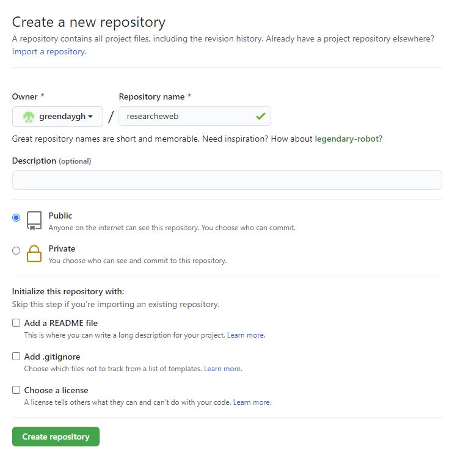
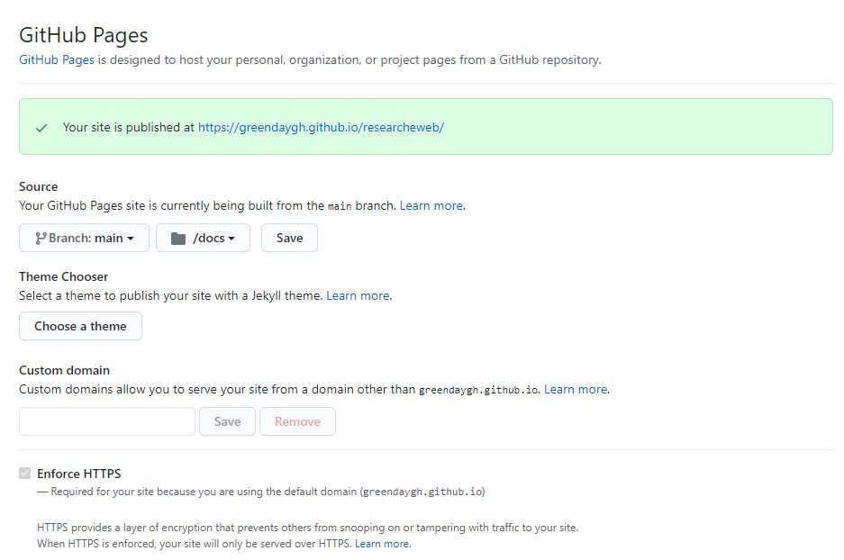

# List of students {.unnumbered}

```{r, echo=F}

std_name <- c("김승화", "김태현", "박성군", "Aporva", "Georgii", "유병현", "오석진", "허성보", "이진주")
std_email <- c('hayleykim97@kribb.re.kr', 'tete310@kribb.re.kr', 'tjdrns27@kribb.re.kr', 'aporva03@gmail.com',  'sdswpe@gmail.com', 'yoobh256@naver.com', 'dhtjrwls95@naver.com', 'ljj9322@naver.com', 'hsb@kribb.re.kr')
std_aff <- rep("합성생물학전문연구단", length(std_name))
std_acc <- c("user02 / userpass02",
             "user03 / userpass03",
             "user04 / userpass04",
             "user05 / userpass05",
             "user06 / userpass06",
             "user07 / userpass07",
             "user08 / userpass08",
             "user09 / userpass09",
             "user10 / userpass10"
             )
std <- data.frame(std_name, std_acc, std_email, std_aff)
knitr::kable(std, format = "markdown")
```

# Introduction

### 연구동 세미나실 (2021.3.4. 목) {.unnumbered}

생물학이 물리, 화학 분야와 다른 점 중 하나는 그 대상이 너무 복잡하다는 것임. 합성생물학은 생물학에 공학의 개념을 도입하여 복잡한 생명현상의 원리를 실제 만들어가며 이해하려는 시도임. 공학에서의 대부분의 결과물이 그렇듯 합성생물학 연구는 실제 문제에 대한 해결책을 제시하기 위한 목적을 가지고 있음. 발견과 관찰에 기반한 전통적인 생물학 연구의 패러다임이 합성생물학을 통해 발명으로 전환되었다고 볼 수 있음. 본 현장실습에서는 합성생물학 발전의 원동력이 되었던 iGEM 사례 분석을 통해 다음 세 가지 목표로 수업을 진행함.

-   합성생물학 개념 정립
-   사용된 부품/회로들의 정량적 데이터 수집 및 재현성 분석
-   Rmarkdown/Rstudio 활용 능력 학습

```{r, fig.align="center", fig.cap=c("강의자료"), echo=FALSE}
#knitr::include_graphics("material/ResearchE-0304.pdf")
```

# Reproducability in Biology

### 연구동 소회의실 (2021.3.8. 화) {.unnumbered}

생물학에서 실험결과의 낮은 재현성은 생물학 연구의 발전을 저해하는 고질적인 문제임 [@begley2012raise]. 이는 생명체의 복잡성에서 기인한다고 볼 수 있으며 Rmarkdown의 철학 또한 이러한 재현성의 관점에서 해석할 수 있음. 다음은 이러한 Rmarkdown 철학과 필요성에 대한 영상임.

[Garrett Grolemund \| R Markdown The bigger picture \| RStudio (2019)](https://www.youtube.com/watch?v=s9aWmU0atlQ&ab_channel=RStudio){target="blank"}

Rmakrdown은 Rstudio의 강의를 [링크](https://rmarkdown.rstudio.com/lesson-1.html){target="blank"} 참고하며 Markdown은 Pandoc의 문법을 [링크](https://rmarkdown.rstudio.com/authoring_pandoc_markdown.html){target="blank"} 참고.

# Data collection - iGEM teams

### Remotemeeting (2021.3.11. 목) {.unnumbered}

Naver cloud 사용하려 했으나 연구원 정책상 클라우드 사용은 금지되어 있어서 활용 못 함. 우선 각자 개인 PC에 R/Rstudio 설치 요청. 추후 효과적인 자료 공유 방안 고민 필요.

[igem.org](igem.org) 에서 5\~10개 팀을 선정하고 각 팀의 이름, 위키페이지, 요약 등을 각자 자유롭게 작성하여 카톡으로 제출. 아래 리스트의 pdf 외 파일 타입은 다른 이름으로 저장하여 확인.

### 정리 파일 {.tabset}

#### 원본 {.unnumbered}

-   [2-2 iGEM Team 선정 박성군.pdf](material/210311/2-2%20iGEM%20Team%20선정%20박성군.pdf){target="blank"}
-   [210311 현장연구_김태현_210311_160543.pdf](material/210311/210311%20현장연구_김태현_210311_160543.pdf){target="blank"}
-   [210311 iGEM 팀 선정-이진주.hwp](material/210311/210311%20iGEM%20팀%20선정-이진주.hwp){target="blank"}
-   [iGEM 유병현.docx](material/210311/iGEM%20유병현.docx){target="blank"}
-   [iGEM_AporvaGupta.xlsx](material/210311/iGEM_AporvaGupta.xlsx){target="blank"}
-   [iGEM_Georgii.xlsx](material/210311/iGEM_Georgii.xlsx){target="blank"}
-   [igem_오석진.xlsx](material/210311/igem_오석진.xlsx){target="blank"}
-   [현장연구 E 210311 수업 김승화.hwp](material/210311/현장연구%20E%20210311%20수업%20김승화.hwp){target="blank"}
-   [iGEM_허성보.xlsx](material/210311/iGEM_허성보.xlsx){target="blank"}

#### 제출 pdf 20210311 {.unnumbered}

```{r, eval=T}
pdf_file_names <- dir(path = "material/210311/", pattern = "*.pdf")
print(pdf_file_names)
```

```{r, eval=F, fig.align="center", echo=FALSE, out.width="100%", out.height="400"}
knitr::include_graphics(paste0("material/210311/", pdf_file_names[1]))  
knitr::include_graphics(paste0("material/210311/", pdf_file_names[2]))  
knitr::include_graphics(paste0("material/210311/", pdf_file_names[3]))  
knitr::include_graphics(paste0("material/210311/", pdf_file_names[4]))  
knitr::include_graphics(paste0("material/210311/", pdf_file_names[5]))  
knitr::include_graphics(paste0("material/210311/", pdf_file_names[6]))  
knitr::include_graphics(paste0("material/210311/", pdf_file_names[7]))  
knitr::include_graphics(paste0("material/210311/", pdf_file_names[8]))
knitr::include_graphics(paste0("material/210311/", pdf_file_names[10])) 

```

------------------------------------------------------------------------

# Rmarkdown practice

### Remotemeeting (2021.3.15. 월) {.unnumbered}

### 목표 {.unnumbered}

-   각자 정리한 iGEM 정리한 테이블을 검토하고 공통적으로 선택한 team이 있을 경우 논의를 통해 조정
-   본인이 선택한 team에서 사용한 방법 이해
-   본인이 선택한 team에서 사용한 DNA 부품, 회로 정리
-   Rmarkdown, R 사용법 실습 (아래 참고)

### 할 일 {.unnumbered}

-   Rstudio 접속: <http://192.168.122.155:8787>
-   주어진 계정 (user02\~user10) 으로 로그인
-   프로젝트 생성, 프로젝트이름은 ResearchE-userxx
-   Markdown 연습 [링크](https://rmarkdown.rstudio.com/authoring_pandoc_markdown.html){target="blank"}
-   Rmakrdown 연습 [링크](https://rmarkdown.rstudio.com/lesson-1.html){target="blank"}
-   본인이 정리한 iGEM team과 다른 사람이 정리한 iGEM team 비교
-   각자 정리한 iGEM 정리한 테이블이 모두 다른 포멧, 내용이나 이를

### Appearance of HTML documents

<https://bookdown.org/yihui/rmarkdown/html-document.html#appearance-and-style>

### Data frame {.unnumbered}

데이터프레임 실습을 위해 다음과 같이 code chunk를 추가함 (Ctrl + Alt + i). 참고로 R 코드를 실행하는 것은 해당 코드에 커서를 위치시키고 창 오른쪽 상단 Run 아이콘을 클릭하거나 단축키 (Ctrl + Enter) 실행.

```{r}


## generate data

teamname <- rep(c("TeamA", "TeamB", "TeamA", "TeamB"), 10)
teamtopic <-  rep(c("TopicA", "TopicB", "TopicA", "TopicB"), 10)
teamprobms <-  rep(c("ProbA", "ProbA", "ProbA", "ProbA"), 10)

## generate a data.frame variable

teamdf <- data.frame(teamname, teamtopic, teamprobms)
teamdf


```

------------------------------------------------------------------------

# Rmarkdown practice cont.

### Remotemeeting (2021.3.18. 목) {.unnumbered}

-   [Remotemeeting 링크](https://www.remotemeeting.com/reservation/share/ff80808178117eb70178405d4c4a283f){target="_blank_"}
-   강좌용 GitHub web page <https://greendaygh.github.io/researchE2021/>

### 수업목표 {.unnumbered}

-   Rstudio 사용법, Rmarkdown 만드는 방법 익히기
-   iGEM 팀 정보 (part포함) 정리해서 html 리포트 만들기
-   리포트를 pdf로 만들어서 email 제출

## Rstudio 사용법 for Rmarkdown

Rstudio를 사용한 Rmarkdown 만드는 법을 익힙니다. Rstudio는 R언어 외에도 다양한 언어를 이용한 프로그래밍을 지원하며 Rstudio의 철학 중 하나는 Rmarkdown, shiny 등을 활용한 사람들과의 소통입니다. 각자 사용에 익숙해지길 바라며 주요 항목은 다음과 같습니다.

-   Rstudio를 활용한 파일 업로드 및 다운로드 방법
-   Rmarkdown 작성을 위한 Visual mode 활용
-   Visual model에서 이미지, 참고문헌[@Singh2020], 코드블럭 넣기

``` {.python}
a = 2
b = 3
c = a*b
```

## Data frame 실습

### Vector

vector는 R의 기본 데이터 구조입니다. numeric vector, logical vector, character vector 등 저장되는 값의 타입에 따라 크게 세가지로 나눌 수 있으며 `class()` 함수를 이용해서 값의 타입을 알아낼 수 있습니다. `Combine function`인 `c()`를 활용하여 만들며 값을 순차적으로 붙여갈 수 있습니다.

```{r}
v1 <- c(1, 2, 3, 4, 5)
v2 <- c("a", "b", "c", "d", "e")
class(v1)
class(v2)
```

### Data frame

데이터프레임은 매트릭스와 같은 형태로 컬럼 하나가 하나의 벡터 변수로서 각 변수들이 다른 모드의 값을 저장할 수 있습니다. \$ 기호를 이용하여 각 구성 변수를 참조할 수 있습니다. 컬럼 한 줄이 하나의 변수 이므로 새로운 변수도 컬럼 형태로 붙여 넣을 수 있습니다. 즉, 각 row는 샘플을 나타내고 각 column은 변수를 나타내며 각 변수들이 갖는 샘플의 개수 (row의 길이, vector 의 길이)는 같아야 합니다. R 기반의 데이터 분석에서는 가장 선호되는 데이터 타입이라고 볼 수 있습니다.

```{r}
v_df <- data.frame(v1, v2)
v_df
class(v_df)
```

```{r}
v3 <- c(121, 22, 31, 98, 45)
v4 <- c("teamA", "teamB", "teamC", "teamD", "teamE")
v_df <- data.frame(v1, v2, v3, v4)
v_df
```

## Create a html page

iGEM 팀 관련 내용 정리해서 rmarkdown으로 html 리포트를 만듭니다. 주로 정리할 내용은 다음과 같습니다.

-   팀이름
-   소속 조직
-   제목
-   분류
-   wiki page
-   해결하고자 하는 문제 (가능한 간단히)
-   주요 해결 방법 (가능한 간단히)
-   사용한 부품
-   vector map

## Create a pdf file

위에서 만든 rmarkdown 리포트를 pdf로 만들어서 제출합니다.

### 제출 pdf 파일 20210318 {.tabset}

#### 제출 pdf list 20210318 {.unnumbered}

```{r, eval=T}
pdf_file_names <- dir(path = "material/210318/", pattern = "*.pdf")
print(pdf_file_names)
```

------------------------------------------------------------------------

#### 제출 pdf 20210318 {.unnumbered}

```{r, eval=F, fig.align="center", echo=FALSE, out.width="100%", out.height="400"}
knitr::include_graphics(paste0("material/210318/", pdf_file_names[1]))  
knitr::include_graphics(paste0("material/210318/", pdf_file_names[2]))  
knitr::include_graphics(paste0("material/210318/", pdf_file_names[3]))  
knitr::include_graphics(paste0("material/210318/", pdf_file_names[4]))  
knitr::include_graphics(paste0("material/210318/", pdf_file_names[5]))  
knitr::include_graphics(paste0("material/210318/", pdf_file_names[6]))  
knitr::include_graphics(paste0("material/210318/", pdf_file_names[7]))  
knitr::include_graphics(paste0("material/210318/", pdf_file_names[8]))  

```

#### 제출 html 20210318 {.unnumbered}

[박성군](material/210318/iGEMpsg.html)

# Rmarkdown on the web

### Remotemeeting (2021.3.22. 월) {.unnumbered}

-   [Remotemeeting 링크](https://www.remotemeeting.com/reservation/share/2c908ad678114c4c01785595a4e231a8){target="_blank_"}

### 수업목표 {.unnumbered}

-   (계속) Rstudio 사용법, Rmarkdown 만드는 방법 익히기, Git 사용법 익히기
-   Github page 만들기
-   Github page 주소 이메일로 전달

## Create GitHub pages

GitHub에 webpage를 만드는 연습을 하겠습니다.

[github-page-rstudio.html](github-page-rstudio.html)

## GitHub page list

```{r, echo=F}

github.page <- c("https://hayleykim97.github.io/ResearchE/",
                 "https://th-kim310.github.io/ResearchE/",
                 "https://Lelp27.github.io/researchE/",
                 "https://aputron.github.io/researchE/",
                 "https://gpemelianov.github.io/researchE/",
                 "https://yoo-bh.github.io/researchE/",
                 "https://seokjin-oh.github.io/researchE/",
                 "https://treebird19.github.io/researchE/",
                 "https://JinjuLee119.github.com/JJ/"
                 )
std <- data.frame(std_name, std_email, github.page)
knitr::kable(std, format = "markdown")

```

# Rmarkdown on the web II

### 수업목표 (2021.3.25. 목) {.unnumbered}

-   (계속) Rstudio 사용법, Rmarkdown 만드는 방법 익히기, Git 사용법 익히기
-   새로운 프로젝트와 원격 저장소를 만들기 (지난 시간 복습)
-   Project Name: igemE (대소문자 구분)
-   새로 만든 Github page 주소 이메일로 전달

## Create a new GitHub repository with pages

-   GitHub 새로운 레포지토리 igemE 만들기
-   [github](https://github.com)에 로그인 후 Repository 생성
-   Public (README.md 생성 안 함) 옵션을 주고 완료

## Create a new project in Rstudio

-   Rstudio \> File \> New Project \> New Directory
-   New Project \> igemE 라는 이름으로 Directory name 입력 \> create project 클릭 (상위 디렉토리 위치 확인)

## Connect local project to GitHub repository

-   Rstudio \> Tools \> Version Control \> Project Setup \> Git/SVN 클릭
-   Version control system에서 git 선택 (Rstudio 재시작 할 수 있음)
-   Rstudio 화면에서 Terminal 텝 선택
-   terminal 1 역삼각형 클릭 `Go to current directory` 선택

### Local 저장소에 commit

        git add .
        git commit -m "init" 
        

### Remote 저장소와 연결

        git branch -M main
        git remote add origin https://github.com/greendaygh/igemE.git
        git push -u origin main

-   위에서 `greendaygh` 대신 본인 GitHub ID 입력

## GitHub page 생성

-   브라우저로 본인의 GitHub page 이동
-   Settings \> Options \> GitHub Pages 에서 Source를 Main branch로, foldedr는 /(root)로 설정 후 Save.

## 새로운 페이지 생성

-   Rstudio \> New File \> Markdown File

-   다음 입력 후 README.md로 저장

          This is readme markdown file

## 로컬, 리모트 저장소에 Commit 및 Push

-   Rstudio 상단 GIT 아이콘 \> Commit
-   또는 Ctrl + ALT + M
-   README.md 파일 Staged에 체크
-   오른쪽 Commit message에 "Upload README file" 이라고 입력 후 Commit 버튼 클릭
-   팝업창 Close 후 오른쪽 상단 Push 클릭
-   팝업창 Close 후 Git 창도 닫기

## 웹 페이지 확인

-   브라우저를 통해 리모트 레포지토리 확인 (greendaygh 대신 본인 아이디 입력)

         https://github.com/greendaygh/igemE/

-   README.md 파일 확인

-   브라우저 주소창에 다음 입력 (greendaygh 대신 본인 아이디 입력) 메세지 확인

          https://greendaygh.github.io/igemE/

# Rmarkdown on the web III

### 수업목표 (2021.3.29. 월) {.unnumbered}

-   (계속) Rstudio 사용법, Rmarkdown 만드는 방법 익히기, Git 사용법 익히기
-   지난 시간 만든 igemE (대소문자 구분) 페이지 만들기 계속 (완료하지 못 한 경우)
-   본인이 조사했던 igem team 및 part 정보를 2개 테이블 (iGEM_team, iGEM_part)로 만들어서 웹에 올리기

## igemE 페이지 완성

완료하지 못 한 학생의 경우 지난 시간 자료 참고해서 완성. 강사가 직접 다니며 검토 가능.

```{r, echo=F}

igeme.page <- c("https://hayleykim97.github.io/igemE/",
                 "https://th-kim310.github.io/igemE/",
                 "https://Lelp27.github.io/igemE/",
                 "https://aputron.github.io/igemE/",
                 "https://gpemelianov.github.io/igemE/",
                 "https://yoo-bh.github.io/igemE/",
                 "https://seokjin-oh.github.io/igemE/",
                 "https://treebird19.github.io/igemE/",
                 "https://JinjuLee119.github.com/igemE/"
                 )
std <- data.frame(std_name, igeme.page)
knitr::kable(std, format = "markdown")

```

## iGEM part Rmarkdown 페이지 만들기

-   igem_part.Rmd 라는 새로운 파일 생성
-   이 파일에 다음과 같은 형식으로 2개의 테이블 (iGEM_team, iGEM_part) 생성
-   완성 후 Knit 이용 html 페이지 생성

### iGEM_team 테이블

```{r, eval=F}
no <- c(1, 2)
team_name <- c("Queens-Canada", 
               "Tainan")
project_title <- c("Velcrion",
                   "Oh_My_Gut")
project_year <- c(2020, 
                  2019)
wiki_page <- c("https://2020.igem.org/Team:Queens_Canada",
               "https://2019.igem.org/Team:NCKU_Tainan")

igem_team <- data.frame(no, 
                        team_name, 
                        project_title, 
                        project_year, 
                        wiki_page)
#knitr::kable(std, format = "markdown")
knitr::kable(igem_team)
```

### iGEM_part 테이블

```{r}
no <- c(1, 2, 3)

part_id <- c("BBa_K2259000", 
             "BBa_K2259010",
             "BBa_K2259092")
part_name <- c("SynORI framework RNA II - Replication Initiator (Group A)",
               "Rop protein - global copy number inhibitor (SynORI framework)",
               "Minimal base vector for SynORI system building")
part_type <- c("Prject",
               "Coding",
               "Plasmid")
team_id <- c(2, 2, 2)

igem_part <- data.frame(no,
                        part_id, 
                        part_name,
                        part_type, 
                        team_id)

knitr::kable(igem_part)
```

part_name은 아래와 같이 part registry 페이지의 큰 글씨로된 타이틀이며 team_id는 앞서 iGEM_team 테이블의 해당팀의 no를 넣음.


## README.md 에 igem_part 파일 링크 생성 후 git에 업로드

-   README.md 파일에 다음 링크 생성

          [iGEM part](igem_part.html)

-   Git add 및 commit (Local repository)

-   Git push (Remote repository)

-   igemE 웹페이지 확인

# iGEM 부품 사용 사례 분석

-   [Remotemeeting 링크](https://www.remotemeeting.com/reservation/share/ff808081788431680178892794ec044e){target="_blank_"}
-   강좌용 GitHub web page <https://greendaygh.github.io/researchE2021/>

## 수업목표 (2021.4.01. 목)

-   지난 시간 만든 igemE (대소문자 구분) 페이지 만들기 완료 (완료하지 못 한 경우)
-   igem에서 사용된 promoter 10종에 대해서 [Most_Used_Promoters](http://parts.igem.org/cgi/partsdb/pgroup.cgi?pgroup=most_used_promoters) 각자 할당된 프로모터에 대해서 1개 experience (igem 팀사례) 분석
-   프로모터의 정량적 특성을 파악하기 위해 해당 프로모터에 의해서 형광 또는 발색 Reporter가 발현하는 사례를 위주로 탐색하고 정리

## igemE 페이지 및 할당 프로모터

```{r, eval=T}
igeme.page <- c("https://hayleykim97.github.io/igemE/",
                 "https://th-kim310.github.io/igemE/",
                 "https://Lelp27.github.io/igemE/",
                 "https://aputron.github.io/igemE/",
                 "https://gpemelianov.github.io/igemE/",
                 "https://yoo-bh.github.io/igemE/",
                 "https://seokjin-oh.github.io/igemE/",
                 "https://treebird19.github.io/igemE/",
                 "https://jinjulee119.github.io/igemE2/"
                 )
promoters <- c("BBa_R0040", "BBa_R0010", "BBa_J23100",
               "BBa_R0011", "BBa_I0500", "BBa_J23101",
               "BBa_R0051", "BBa_J23119", "BBa_R0062")
std <- data.frame(std_name, igeme.page, promoters)
knitr::kable(std, format = "markdown")

```

## create Promoter.Rmd file

새로운 Promoter.Rmd 파일을 만들고 할당된 프로모터의 사례를 한 가지 찾아 정리함. 이를 위해서 해당 프로모터를 사용한 팀들의 문서 (정보)를 공부하고 다음 정보를 뽑아낼 필요가 있음.

-   해당 팀 정보 (지난시간 만든 테이블)
-   사용한 부품 및 회로 정보 (지난 시간 만든 테이블에 회로 포함)
-   회로 만드는 프로토콜 정보 (추가 테이블)
-   리포터 발현 배양/실험 조건 및 측정 방법 (추가 테이블)

각 테이블에 어떤 정보가 들어가야 할지는 고민해 보기 바람. 예를 들어 리포터 발현 배양 조건에 온도, 배양 시간 등.


------------------------------------------------------------------------

# Rmarkdown on the web III

#### 수업목표 (2021.4. 4. 월) {.unnumbered}

-   휴강
-   지난 시간 완료하지 못 한 페이지 완성,
-   본인이 조사했던 igem team 및 part 정보를 2개 테이블 (iGEM_team, iGEM_part)로 만들어서 웹에 올리기

## igemE 페이지 완성

완료하지 못 한 학생의 경우 지난 시간 자료 참고해서 완성. 강사가 직접 다니며 검토 가능.

------------------------------------------------------------------------

# Analysis of the promoter data I {#promoteranalysis1}

-   [Remotemeeting 링크](https://www.remotemeeting.com/reservation/share/2c908ad67883bb590178ac67587b2525){target="_blank_"}

### 수업목표 (2021.4. 7. 목) {.unnumbered}

-   프로모터 데이터 분석을 통한 데이터 이해 및 재정리
-   새로운 Promoter_2nd.Rmd 파일 만들고 웹에 올리기

### 분석 예시 {.unnumbered}

분석 데이터를 4개 (또는 3개) 테이블로 정리 (4/1)

### 예시1 {.unnumbered}

-   <https://th-kim310.github.io/igemE/Promoter.html>
-   [HKU Wiki](https://2019.igem.org/Team:Hong_Kong_HKU)
-   [Poster](https://2019.igem.org/Team:Hong_Kong_HKU/Poster)

#### igem_team 테이블 {.unnumbered}

```{r, eval=T}

id <- c(1)
team_name <- c("Hong_Kong_HKU")
project <- c("Engineered Salmonella Typhimurium for enhanced drug delivery and cancer stem cell targeting")
year <- c(2019)
wiki <- c("https://2019.igem.org/Team:Hong_Kong_HKU")

igem_team <- data.frame(id, 
                        team_name, 
                        project, 
                        year, 
                        wiki)
#knitr::kable(igem_team)
igem_team
```

#### igem_part 테이블 {.unnumbered}

```{r, eval=T}

id <- 1:4
BBid <- c("BBa_R0010", "BBa_B0034", "BBa_E1010", "BBa_B0054")
type <- c("Promoter", "RBS", "RFP", "Terminator")
link <- c("http://parts.igem.org/Part:BBa_R0010",
           "http://parts.igem.org/Part:BBa_B0034",
           "http://parts.igem.org/Part:BBa_E1010",
           "http://parts.igem.org/Part:BBa_B0054")
backbone <- rep("-", length(id))
device_id <- paste0("D", sprintf("%04d", rep(1, length(id))) )
team_name <- rep("Hong_Kong_HKU", length(id))
user <- rep("th-kim310", length(id))

igem_part <- data.frame(id, BBid, type, link, backbone, device_id, team_name, user)
#knitr::kable(igem_part)
igem_part
```

```{r, eval=F}
paste0("ATG", "TGA")
rep(1, length(id))
sprintf("%04d", rep(1, length(id)))
paste0("D", sprintf("%04d", rep(1, length(id))) )
```

#### igem_obs 테이블 (observation) {.unnumbered}

```{r, eval=T}

id <- c(1:4)
strain <- c("E.coli", "E.coli", "S.Typhi", "S.Typhi")
indc <- rep("IPTG", length(id))
conc <- c(0, 10, 0, 10)
value <- c(5000, 15000, 15000, 15000)
valunit <- rep("Fluorescence", length(id))
incubhr <- rep("-", length(id))
incubtemp <- rep("-", length(id))
device_id <- rep("D0001", length(id))
link <- c("https://2019.igem.org/Team:Hong_Kong_HKU/Characterization",
           "https://2019.igem.org/Team:Hong_Kong_HKU/Characterization",
           "https://2019.igem.org/Team:Hong_Kong_HKU/Characterization",
           "https://2019.igem.org/Team:Hong_Kong_HKU/Characterization")


igem_obs <- data.frame(id, strain, indc, conc, value,
                        valunit, incubhr, incubtemp,
                       device_id, link)
#knitr::kable(igem_obs)
igem_obs
```

#### 테이블 통합 {.unnumbered}

```{r}
library(tidyverse)

# left_join(igem_part, igem_team, by="team_name")
# igem_part %>% left_join(igem_team, by="team_name")

igem_promoter <- igem_part %>% 
  left_join(igem_team, by="team_name") %>% 
  left_join(igem_obs, by="device_id")

igem_promoter
```

#### 데이터 정리 {.unnumbered}

```{r}
colnames(igem_promoter)
```

```{r}

plot_data <- igem_promoter %>% 
  filter(BBid=="BBa_R0010") %>% 
  select(strain, conc, value) %>% 
  mutate(strain=factor(strain), conc=factor(conc))

```

```{r}

ggplot(plot_data, aes(x=strain, y=value, fill=conc)) +
  geom_bar(stat="identity", position=position_dodge(width=0.5), width=0.4) +
  scale_fill_manual(values=c("#ce1212", "#4a47a3")) +
  theme_bw()
  
```

# Analysis of the promoter data II {#promoteranalysis2}

-   [Remotemeeting 링크](https://www.remotemeeting.com/reservation/share/ff808081788431680178c19876533048){target="_blank_"}

### 수업목표 (2021.4. 12. 월) {.unnumbered}

-   프로모터 데이터 분석을 통한 데이터 이해 및 재정리 2nd
-   새로운 Promoter_3rd.Rmd 파일 만들고 웹에 올리기

### 분석 예시 {.unnumbered}

분석 데이터를 3개 테이블로 정리 (igem_part, igem_team, igem_obs)

### 예시2 {.unnumbered}

-   <https://treebird19.github.io/igemE/Promoter_2nd.html>
-   [Nottingham Wiki](http://2018.igem.org/Team:Nottingham)

#### igem_team table {.unnumbered}

```{r}

igem_team <- data.frame(id = "1",
             team_name = "Nottingham",
             project = "Engineer a phage which will infect C. difficile and express genetic constructs designed to suppress toxin production.",
             year = "2018",
             wiki = "http://2018.igem.org/Team:Nottingham")
```

### Vector map {.unnumbered}

<http://parts.igem.org/Part:BBa_K2715119>\
{width="600"}

### Result {.unnumbered}

[결과](http://parts.igem.org/File:BBa_K2715114_family_GFP_assay_2.png){width="600"}

### igem_part table {.unnumbered}

```{r}
igem_part <- data.frame(id = 1:4,
             BBid = c("BBa_J23119",
                      "BBa_K2715009",
                      "BBa_E0040",
                      "-"),
             type = c("Promoter",
                      "RBS",
                      "GFP",
                      "Terminator"),
             link = c("http://parts.igem.org/Part:BBa_J23119",
                      "http://parts.igem.org/Part:BBa_K2715010",
                      "http://parts.igem.org/Part:BBa_E0040",
                      "-"),
             backbone = rep("pMTL84151", 4),
             device_id = paste0("D", sprintf("%04d", rep(1, 4))),
             team_name = rep("Nottingham", 4),
             user = rep("sb.h", 4))
igem_part
```

### igem_obs table {.unnumbered}

지난 테이블에 비해 concunit 변수 추가

```{r}

igem_obs <- data.frame(id = 1,
             strain = c("E. coli"),
             indc = c("-"),
             conc = c(NA),
             concunit = c(NA),
             value = c(0.06),
             valunit = c("uM Fluorescein/OD"),
             incubhr = 6,
             incubtemp = "37",
             device_id = paste0("D", sprintf("%04d", 1)),
             link = c("http://parts.igem.org/Part:BBa_K2715119"))
igem_obs
```

### Binding two tables {.unnumbered}

같은 컬럼 이름끼리 데이터를 (row) 추가하며 이름이 다를 경우 추가 컬럼을 생성해서 병합됨. `dplyr`패키지의 `bind_rows`, `bind_cols` 함수를 사용. 같은 컬럼의 데이터 타입이 다를 경우 (integer vs character) 에러 발생.

```{r}
library(tidyverse)

id <- c(1)
team_name <- c("Hong_Kong_HKU")
project <- c("Engineered Salmonella Typhimurium for enhanced drug delivery and cancer stem cell targeting")
year <- c(2019)
wiki <- c("https://2019.igem.org/Team:Hong_Kong_HKU")

igem_team1 <- data.frame(id, 
                        team_name, 
                        project, 
                        year, 
                        wiki)

igem_team2 <- data.frame(id = "1",
             team_name = "Nottingham",
             project = "Engineer a phage which will infect C. difficile and express genetic constructs designed to suppress toxin production.",
             year = "2018",
             wiki = "http://2018.igem.org/Team:Nottingham")

# error
#bind_rows(igem_team1, igem_team2)


id <- c("1")
team_name <- c("Hong_Kong_HKU")
project <- c("Engineered Salmonella Typhimurium for enhanced drug delivery and cancer stem cell targeting")
year <- c("2019")
wiki <- c("https://2019.igem.org/Team:Hong_Kong_HKU")

igem_team1 <- data.frame(id, 
                        team_name, 
                        project, 
                        year, 
                        wiki)

bind_rows(igem_team1, igem_team2)
igem_team <- bind_rows(igem_team1, igem_team2, .id="id")

```

부품 테이블 결합

```{r}
# igem_part

id <- 1:4
BBid <- c("BBa_R0010", "BBa_B0034", "BBa_E1010", "BBa_B0054")
type <- c("Promoter", "RBS", "RFP", "Terminator")
link <- c("http://parts.igem.org/Part:BBa_R0010",
           "http://parts.igem.org/Part:BBa_B0034",
           "http://parts.igem.org/Part:BBa_E1010",
           "http://parts.igem.org/Part:BBa_B0054")

backbone <- rep("-", length(id))
device_id <- paste0("D", sprintf("%04d", rep(1, length(id))) )
team_name <- rep("Hong_Kong_HKU", length(id))
user <- rep("th-kim310", length(id))

igem_part1 <- data.frame(id, BBid, type, link, backbone, device_id, team_name, user)


igem_part2 <- data.frame(id = 1:4,
             BBid = c("BBa_J23119",
                      "BBa_K2715009",
                      "BBa_E0040",
                      "-"),
             type = c("Promoter",
                      "RBS",
                      "GFP",
                      "Terminator"),
             link = c("http://parts.igem.org/Part:BBa_J23119",
                      "http://parts.igem.org/Part:BBa_K2715010",
                      "http://parts.igem.org/Part:BBa_E0040",
                      "-"),
             backbone = rep("pMTL84151", 4),
             device_id = paste0("D", sprintf("%04d", rep(1, 4))),
             team_name = rep("Nottingham", 4),
             user = rep("sb.h", 4))
igem_part2

igem_part <- bind_rows(igem_part1, igem_part2, .id="id")
igem_part
```

```{r}

id <- c(1:4)
strain <- c("E.coli", "E.coli", "S.Typhi", "S.Typhi")
indc <- rep("IPTG", length(id))
conc <- c(0, 10, 0, 10)
concunit = rep("mM", 4)
value <- c(5000, 15000, 15000, 15000)
valunit <- rep("Fluorescence", length(id))
incubhr <- rep(NA, length(id))
incubtemp <- rep(NA, length(id))
device_id <- rep("D0001", length(id))
link <- c("https://2019.igem.org/Team:Hong_Kong_HKU/Characterization",
           "https://2019.igem.org/Team:Hong_Kong_HKU/Characterization",
           "https://2019.igem.org/Team:Hong_Kong_HKU/Characterization",
           "https://2019.igem.org/Team:Hong_Kong_HKU/Characterization")


igem_obs1 <- data.frame(id, strain, indc, conc, concunit, value,
                        valunit, incubhr, incubtemp,
                       device_id, link)


igem_obs2 <- data.frame(id = 1,
             strain = c("E. coli"),
             indc = c("Const"),
             conc = c(NA),
             concunit = c(NA),
             value = c(0.06),
             valunit = c("uM Fluorescein/OD"),
             incubhr = 6,
             incubtemp = "37",
             device_id = paste0("D", sprintf("%04d", 1)),
             link = c("http://parts.igem.org/Part:BBa_K2715119"))

igem_obs <- bind_rows(igem_obs1, igem_obs2, .id="id")
igem_obs
```

# Analysis of the promoter data III {#promoteranalysis3}

-   [Remotemeeting 링크](https://www.remotemeeting.com/reservation/share/2c90e4f77883a3110178d2cb8c514aa0){target="_blank_"}

### 수업목표 (2021.4. 15. 목) {.unnumbered}

-   프로모터 데이터 분석을 통한 데이터 이해 및 재정리 3rd
-   엑셀 또는 csv 파일 읽어오는 함수 사용법 익히고 `igem_promoters.xlsx` 파일을 만들기
-   기존 조사한 프로모터와 함께 재할당된 프로모터 정량분석 1건 이상 추가 수행\
-   코드를 `Promoter_4th.Rmd`에 작성하고 웹에 올리기

## 프로모터 재할당

```{r, eval=T}
igeme.page <- c("https://hayleykim97.github.io/igemE/",
                 "https://th-kim310.github.io/igemE/",
                 "https://Lelp27.github.io/igemE/",
                 "https://aputron.github.io/igemE/",
                 "https://gpemelianov.github.io/igemE/",
                 "https://yoo-bh.github.io/igemE/",
                 "https://seokjin-oh.github.io/igemE/",
                 "https://treebird19.github.io/igemE/",
                 "https://jinjulee119.github.io/igemE2/"
                 )
promoters <- c("BBa_R0010", "BBa_J23100",
               "BBa_R0011", "BBa_I0500", "BBa_J23101",
               "BBa_R0051", "BBa_J23119", "BBa_R0062", "BBa_R0040")
std <- data.frame(std_name, igeme.page, promoters)
knitr::kable(std, format = "markdown")

```

## Loading excel data into R

지금까지는 코드를 이용한 데이터 정리를 진행하면서 우리에게 필요한 데이터를 생각해보고 정리하는 방법을 학습했습니다. 그러나 데이터가 많아질수록 코드에 직접 저장하는 방식은 비효율적이게 되며 따라서 파일이나 엑셀을 이용해서 데이터를 저장하거나 양이 더 많아질경우 데이터베이스 DBMS를 사용합니다.

이번 수업에서는 엑셀이나 텍스트 파일 형태로 데이터를 저장하는 방법을 학습하고 프로모터 데이터 수집에 활용하도록 합니다. 우선 다음과 같이 엑셀 데이터를 만들고 `readxl` 패키지의 `read_excel` 함수 사용해서 읽는 코드를 작성합니다. 참고로 서버의 Rstudio를 사용할 경우 로컬 컴퓨터에서 만든 엑셀 파일은 Rstudio 파일 브라우져의 upload 기능을 사용해서 서버로 옮겨준 후 사용할 수 있습니다.


```{r}
#install.packages("readxl")
library(readxl)

igem_team <- read_excel("igem_promoters.xlsx", sheet=1, skip = 0, col_names=T)
igem_team
```

하나의 엑셀 파일 igem_promoters.xlsx에 세 개의 데이터시트 igem_team, igem_part, igem_obs를 만듭니다. 읽어올 경우 sheet=1 이 부분을 2, 3으로 바꿔서 읽어 오면 되겠습니다.

## 기존 데이터를 csv에 쓰고 다시 읽기

기존 정리했던 데이터를 쉽게 excel 파일로 옮기기 위해서 다음과 같이 csv 파일로 저장 후 excel 파일로 전환할 수 있습니다. 아래는 지난시간 수행했던 igem_part 데이터 입니다.

```{r}
library(tidyverse)
# igem_part

id <- 1:4
BBid <- c("BBa_R0010", "BBa_B0034", "BBa_E1010", "BBa_B0054")
type <- c("Promoter", "RBS", "RFP", "Terminator")
link <- c("http://parts.igem.org/Part:BBa_R0010",
           "http://parts.igem.org/Part:BBa_B0034",
           "http://parts.igem.org/Part:BBa_E1010",
           "http://parts.igem.org/Part:BBa_B0054")

backbone <- rep("-", length(id))
device_id <- paste0("D", sprintf("%04d", rep(1, length(id))) )
team_name <- rep("Hong_Kong_HKU", length(id))
user <- rep("th-kim310", length(id))

igem_part1 <- data.frame(id, BBid, type, link, backbone, device_id, team_name, user)
igem_part2 <- data.frame(id = 1:4,
             BBid = c("BBa_J23119",
                      "BBa_K2715009",
                      "BBa_E0040",
                      "-"),
             type = c("Promoter",
                      "RBS",
                      "GFP",
                      "Terminator"),
             link = c("http://parts.igem.org/Part:BBa_J23119",
                      "http://parts.igem.org/Part:BBa_K2715010",
                      "http://parts.igem.org/Part:BBa_E0040",
                      "-"),
             backbone = rep("pMTL84151", 4),
             device_id = paste0("D", sprintf("%04d", rep(1, 4))),
             team_name = rep("Nottingham", 4),
             user = rep("sb.h", 4))

igem_part <- bind_rows(igem_part1, igem_part2, .id="id")
igem_part
```

위 데이터를 csv 파일로 저장할 경우 다음과 같이 수행할 수 있습니다. 코드를 수행하면 igem_part.csv 파일이 만들어지고 excel 파일로 해당 파일을 읽은 후 igem_promoters.xlsx 파일의 igem_part 시트에 붙여넣으면 되겠습니다.

```{r, eval=F}

write.csv(igem_part, "igem_part.csv", quote=F, row.names=F)

```

위와같은 방식으로 엑셀 데이터를 만들고 앞서 할당된 프로모터에 대한 정보를 저장한 후 다음과 같이 엑셀파일을 읽으면 되겠습니다.

```{r, eval=F}
library(readxl)

igem_team <- read_excel("igem_promoters.xlsx", sheet=1, skip = 0, col_names=T)
igem_part <- read_excel("igem_promoters.xlsx", sheet=2, skip = 0, col_names=T)
igem_obs <- read_excel("igem_promoters.xlsx", sheet=3, skip = 0, col_names=T)

```

# Analysis of the promoter data IV {#promoteranalysis4}

-   [Remotemeeting 링크](https://www.remotemeeting.com/reservation/share/2c908ad67883bb590178e7270b585cec){target="_blank_"}

## 수업목표 (2021.4. 19. 월) {.unnumbered}

-   다른 사람 excel 파일 다운로드 및 읽어오기

-   데이터 병합하기 (표준화 (정형화) 확인)

-   프로모터 정량 분석 1건 수행

-   모든 팀원 프로모터 정보를 모으는 코드 `Promoter_5th.Rmd` 작성 후 웹링크

-   중간점검

    -   학습 내용 이해도

    -   최종 보고서 작성법: Rmd 파일로 작성

    -   최종 보고서 범위:

        -   서론 (Introduction):
        -   본론 (Results):
        -   결론 (Conclusion, discussin):

## 원격 데이터 다운로드 및 읽기

각 개인이 만들어 놓은 엑셀 데이터를 읽어오기 위해서 원격으로 해당 파일을 다운로드한 후 읽어오는 작업을 수행함.

-   먼저 해당 사용자의 ID를 이용해서 git repository로 이동 (<https://github.com/>)(아이디/)(igemE) ex) <https://github.com/TH-Kim310/igemE>.
-   해당 엑셀 파일 클릭 후 `Download` 버튼의 링크 주소 복사 url 이라는 변수에 저장.
-   `download.file()` 함수 사용해서 다운로드

```{r, eval=F}
library(tidyverse)
library(readxl)

?download.file
url <- "https://github.com/TH-Kim310/igemE/raw/main/%EC%97%91%EC%85%80.xlsx"
download.file(url, "th-kim310.xlsx")

url <-  "https://github.com/jinjulee119/igemE2/raw/main/igem_promoters.xlsx"
download.file(url, "jinjulee119.xlsx")
```

그런데 다운로드한 모든 파일이 root 디렉토리에 저장될 경우 관리가 어렵다는 문제가 있으므로 디렉토리 만들어서 저장함.

-   create.dir 함수로 `download/promoter` 디렉토리 만들기
-   `download/promoter` 위치를 destdir 변수에 저장하고 사용하기
-   `paste0()`함수 사용해 보기 (ex. `paste0("abc", "def")`)

```{r, eval=F}

dir.create("download")
dir.create("download/promoter")

destdir <- "download/promoter/"

url <- "https://github.com/TH-Kim310/igemE/raw/main/%EC%97%91%EC%85%80.xlsx"
download.file(url, paste0(destdir, "th-kim310.xlsx"))

url <-  "https://github.com/jinjulee119/igemE2/raw/main/igem_promoters.xlsx"
download.file(url, paste0(destdir, "jinjulee119.xlsx"))


```

## 데이터 병합

모든 파일의 정보를 읽어오기 위해서 `dir()` 함수를 이용해서 모든 엑셀 파일이름을 `exfilenames` 변수에 저장하고 이를 이용해서 team 정보를 읽어옴. 최종적으로 `bind_rows` 함수를 사용해서 병합.

```{r, eval=F}

exfilenames <- dir(destdir, pattern="*.xlsx")

tmp1 <- read_excel(paste0(destdir, exfilenames[1]), sheet=1, skip=0, col_names=T)
tmp2 <- read_excel(paste0(destdir, exfilenames[2]), sheet=1, skip=0, col_names=T)
igem_team <- bind_rows(tmp1, tmp2)


```

그런데 앞 코드를 자세히 살펴보면 exfilenames의 인덱스만 바뀌고 모든 코드가 같습니다. 이를 for 문으로 활용하면 파일이 많을 경우 더 효율적으로 코딩을 할 수 있습니다. 대신 읽어오는 data을 저장할 적절한 저장공간이 필요한데 이 때 쓰일 수 있는 것이 `list` 형태의 변수 입니다. `list`는 모든 타입의 데이터를 순차적으로 저장할 수 있습니다. 또한 bind_rows를 모든 리스트의 원소에 적용하는 방법은 `do.call`이라는 함수를 사용해서 수행할 수 있습니다.

```{r, eval=F}

exfilenames <- dir(destdir, pattern="*.xlsx")

tmp <- list()
for(i in 1:length(exfilenames)){
  tmp[[i]] <- read_excel(paste0(destdir, exfilenames[i]), sheet=1, skip=0, col_names=T)
}
#igem_team <- bind_rows(tmp1, tmp2)
igem_team <- do.call(bind_rows, tmp)

```

위 코드를 이용하면 igem_part와 igem_obs도 쉽게 모든 정보를 통합할 수 있습니다.

## 데이터 일관성 유지

그러나 여러 사람이 각각 다른 형태로 파일을 저장할 경우 위와 같은 통합은 어려울 수 있습니다. 따라서 아래와 같은 규칙을 통해 모든 사람들이 동일한 방식으로 정보를 저장하고 서로 교환할 수 있습니다.

1)  엑셀 파일 `igem_promoters.xlsx`로 저장 확인
2)  `igem_promoters.xlsx`에 sheet별로 `igem_team`, `igem_part`, `igem_obs` 이름으로 각 데이터 저장 확인
3)  각 테이블 이름 및 데이터 타입 확인

-   igem_team

    -   id (character)
    -   team_name (character)
    -   project (character)
    -   year (character)
    -   wiki (character)

-   igem_part

    -   id (character)
    -   BBid (character)
    -   type (character)
    -   link (character)
    -   backbone (character)
    -   device_id (character) (v)
    -   team_name (character)
    -   user (character)

-   igem_obs

    -   id (character)
    -   strain (character)
    -   indc (character)
    -   conc (numeric)
    -   concunit (character)
    -   value (numeric)
    -   valunit (character)
    -   incubhr (numeric)
    -   incubtemps (character)
    -   device_id (character)
    -   link (character)

## 모든 프로모터 정보 모으기

각자 본인의 폴더에 저장된 데이터가 위 세 가지 룰을 모두 만족하도록 정리. 코드 작성 후 `Promoter_5th.Rmd`에 저장 후 웹 링크

# Analysis of the promoter data V {#promoteranalysis5}

-   [Remotemeeting 링크](https://www.remotemeeting.com/reservation/share/2c908ad67883bb590178f6cfdf8f7085){target="_blank_"}

## 수업목표 (2021.4. 22. 목) {.unnumbered}

-   for 문을 이용한 다른 사람 excel 파일 다운로드
-   for 문을 이용한 모든 데이터 병합하기
-   데이터베이스 테이블 문제 인식

## 원격 데이터 다운로드 II

각 개인이 만들어 놓은 엑셀 데이터를 읽어오기 위해서 원격으로 해당 파일을 다운로드한 후 읽어오는 작업을 수행함. 각 개인의 ID와 디렉토리 이름을 알면 `for`문으로 반복 없이 쉽게 수행할 수 있음. 예를 들어 아래 코드는 for문을 이용해서 반복을 줄이고 재사용이 가능한 코드로 만들 수 있음.

```{r, eval=F}
library(tidyverse)


destdir <- "download/promoters/"

url <-  "https://github.com/jinjulee119/igemE2/raw/main/igem_promoters.xlsx"
download.file(url, paste0(destdir, "jinjulee119.xlsx"))

url <-  "https://github.com/Lelp27/igemE/raw/main/promoter_3nd.xlsx"
download.file(url, paste0(destdir, "Lelp27.xlsx"))

url <-  "https://github.com/aputron/igemE/raw/main/iGEM_team.xlsx"
download.file(url, paste0(destdir, "aputron.xlsx"))

url <-  "https://github.com/gpemelianov/igemE/raw/main/igem_promoter.xlsx"
download.file(url, paste0(destdir, "gpemelianov.xlsx"))

url <-  "https://github.com/Yoo-BH/igemE/raw/main/igem_promoter.xlsx"
download.file(url, paste0(destdir, "yoo-bh.xlsx"))

url <-  "https://github.com/treebird19/igemE/raw/main/igem_promoters.xlsx"
download.file(url, paste0(destdir, "treebird19.xlsx"))
```

ID와 디렉토리만 지정해 주면 나머지는 반복되는 코드이므로 아래와 같이 바꿀 수 있음. 아래 코드는 사람이 변경되거나 늘어나도 아이디, 홈디렉토리만 추가해주거나 변경하면 바로 사용할 수 있음.

```{r, eval=F}
ids <- c("hayleykim97", 
         "th-kim310",
         "Lelp27",
         "aputron",
         "gpemelianov",
         "yoo-bh",
         "seokjin-oh",
         "treebird19",
         "jinjulee119"
         )
homedirs <- c(rep("igemE", 9), "igemE2") 

destdir <- "download/promoter/"

i <- 1
url <-  paste0("https://github.com/", ids[i], "/", homedirs[i], "/raw/main/igem_promoters.xlsx")
destfile <- paste0(destdir, ids[i], ".xlsx")
download.file(url, destfile)


for(i in 1:length(ids)){
  url <-  paste0("https://github.com/", ids[i], "/", homedirs[i], "/raw/main/igem_promoters.xlsx")
  destfile <- paste0(destdir, ids[i], ".xlsx")
  try(download.file(url, destfile))
  cat(i, "\n");flush.console()
}


```

```{r, eval=F}
# extract ids from homepage urls
# igeme.page <- c("https://hayleykim97.github.io/igemE/",
#                  "https://th-kim310.github.io/igemE/",
#                  "https://Lelp27.github.io/igemE/",
#                  "https://aputron.github.io/igemE/",
#                  "https://gpemelianov.github.io/igemE/",
#                  "https://yoo-bh.github.io/igemE/",
#                  "https://seokjin-oh.github.io/igemE/",
#                  "https://treebird19.github.io/igemE/",
#                  "https://jinjulee119.github.io/igemE2/"
#                  )
# 
# ids <- strsplit(igeme.page, split="\\.") %>% 
#   lapply(function(x){
#     gsub("https:\\/\\/", "", x[1])
#     }) %>% 
#   unlist()
#   

```

## 다운로드된 엑셀 파일 읽기 II

`for`문을 이용한 코드 줄이기 및 재사용성 높이기.

```{r, eval=F}
library(readxl)

filenames <- dir(path = destdir, pattern = "*.xlsx")


tmp1 <- list()
tmp2 <- list()
tmp3 <- list()


for(i in 1:length(filenames)) {
  destfile <- paste0(destdir, filenames[i])
  tmp1[[i]] <- read_excel(destfile, sheet = 1, skip = 0, col_names = T)
  tmp2[[i]] <- read_excel(destfile, sheet = 2, skip = 0, col_names = T)
  tmp3[[i]] <- read_excel(destfile, sheet = 3, skip = 0, col_names = T)
}

igem_team <- do.call(bind_rows, tmp1)
igem_part <- do.call(bind_rows, tmp2)
igem_obs <- do.call(bind_rows, tmp3)


```

마지막 igem_obs는 다음의 에러를 내며 병합되지 않음. 이는 tmp3[[1]]의 incubtemp와 tmp3[[2]]의 incubtemp 데이터 타입이 달라서 발생하는 문제임. 모든 사람이 앞서 정한 데이터 포멧의 규칙을 따르면 되며 만약 그렇지 않을 경우 다음과 같이 데이터 타입을 바꿔주면 됨.


```{r, eval=F}


tmp3[[1]]$incubtemp <- as.numeric(tmp3[[1]]$incubtemp)

## when it comes to incubhr 
tmp3[[1]]$incubhr <- rep(6, 12)
tmp3[[1]]$incubhr <- as.numeric(substr(tmp3[[1]]$incubtemp, start = 1, stop = 1))
tmp3[[1]]$incubhr <- as.numeric(gsub(pattern = " hrs", replacement = "", x = tmp3[[1]]$incubhr))

```

## 데이터베이스 테이블 개선

지금까지 우리가 만든 3개의 테이블은 일반적으로 데이터베이스라고 하는 툴을 이용한 데이터 저장 방법과 동일함. 반복되는 저장을 피하기 위해서 테이블을 나누었고 각 테이블을 foreign key 값으로 이어줌. 기본적으로 각 테이블에 저장되는 데이터는 중복 없는 유일한 데이터들만 저장. 그러나 아래와 같은 (현재) 데이터베이스 구조는 문제가 있음. 즉, igem_obs에서 관측된 값은 device_id라는 회로의 활성으로 볼 수 있으나 igem_part에 여러개의 같은 device_id가 있을 수 있으므로 어떤 디바이스의 어떤 part에 대한 활성 값인지 구분할 수 없다는 문제가 발생함.


위 데이터베이스 구조를 아래와 igem_device라는 테이블을 추가하고 이 테이블에 device_id를 중복 없이 저장할 수 있다면 igem_part에서 또는 igem_obs에서 참조하는 값들이 어떤 device인지 쉽게 알 수 있음.


이번 시간에 기억할 부분은 지금까지 만든 igem_promoters.xlsx 파일의 정보들을 위 규칙에 맞게 저장하고 for 문을 이용한 데이터 다운로드와 병합하는 방법임.

# Github pages and markdown {#githubpageandmarkdown}

-   [Remotemeeting 링크](https://www.remotemeeting.com/reservation/share/ff8080817884319d0179193066dd0f8d){target="_blank_"}

## 수업목표 (2021.4. 29. 목) {.unnumbered}

-   Github Pages / Rstudio 리뷰
-   Rmarkdown 활용 웹페이지 만들기

## Github Pages


## Rstudio git

<https://greendaygh.github.io/researchE2021/ResearchE-lecturenote.html#7_Rmarkdown_on_the_web_II>

## Create website

<https://bookdown.org/yihui/rmarkdown/rmarkdown-site.html#a-simple-example>

# Github pages and markdown II {#githubpageandmarkdown2}

-   [Remotemeeting 링크](){target="_blank_"}

## 수업목표 (2021. 5. 3. 목) {.unnumbered}

-   Github Pages 활용한 웹페이지 만들기

## 원격 저장소 만들기

### Create Github repository

[github](https://github.com)에 로그인 후 Repository 생성. Private/Public 등의 적절한 옵션을 주고 완료. 주의사항은 README.md 파일 생성하지 않음



생성하면 다음과 같은 화면이 나옵니다. 이 중 첫 번째 방법을 따라서 수행하면 되는데 본 수업에서는 Rstudio를 이용해서 수행하도록 하겠습니다.


## 로컬 저장소 만들기

### Create a new project in Rstudio

Rstudio \> File \> New Project \> New Directory

New Project \> researcheweb 이라는 이름으로 Directory name 입력 \> create project 클릭. 해당 디렉토리는 원격 저장소와 직접 연결되는 로컬 저장소가 되며 상위 디렉토리 (아래에서는 lectures) 하위에 디렉토리가 생성되며 그 안에 파일들을 저장하게 될 것입니다.


## 로컬-원격 저장소 연결하기

### Connect local project to GitHub repository

Rstudio의 Tools \> Version Control \> Project Setup \> Git/SVN 클릭, Version control system에서 git 선택 (Rstudio 재시작)


Rstudio 화면에서 Terminal 텝 선택, terminal 1 역삼각형 클릭 Go to current directory 선택

    git add .
    git commit -m "init"

위 두 명령어는 로컬 저장소에 파일을 업데이트하는 과정이며 다음과 같은 출력이 보여집니다.

```{bash, eval=F}
cd ~/alpha/lectures/researcheweb
rstudio@898b894376b2:~/alpha/lectures/researcheweb$ git add .
rstudio@898b894376b2:~/alpha/lectures/researcheweb$ git commit -m "init"
[master (root-commit) e45b818] init
 3 files changed, 214 insertions(+)
 create mode 100644 .gitignore
 create mode 100644 createweb.Rmd
 create mode 100644 researcheweb.Rproj
```

그 후 다음과 같이 원격 저장소 정보를 입력하고 branch를 main으로 바꿔준 후 push로 업로드 합니다.

    git remote add origin https://github.com/greendaygh/researcheweb.git
    git branch -M main 
    git push

그러나 push를 할 경우 다음과 같은 에러가 뜨며 처음 push할 경우는 아래 에러 메세지에 나온 것 처럼 입력을 해야 합니다.

```{bash, eval=F}
rstudio@898b894376b2:~/alpha/lectures/researcheweb$ git remote add origin https://github.com/greendaygh/researcheweb.git
rstudio@898b894376b2:~/alpha/lectures/researcheweb$ git branch -M main 
rstudio@898b894376b2:~/alpha/lectures/researcheweb$ git push
fatal: The current branch main has no upstream branch.
To push the current branch and set the remote as upstream, use

    git push --set-upstream origin main
```

만약 push 할 때 사용자 정보를 입력하라는 메세지가 뜰 경우 다음과 같이 본인의 해당 계정에 대한 정보를 입력하면 됩니다.

```{bash, eval=F}
rstudio@898b894376b2:~/alpha/lectures/researcheweb$ git config --global user.name "greendaygh"
rstudio@898b894376b2:~/alpha/lectures/researcheweb$ git config --global user.email "kimhaseong@gmail.com"
```

다시 push 명령어를 아래와 같이 입력하면 원격저장소에 업데이트가 되며 원격저장소에 (github 저장소) 정상적으로 파일이 올라간 것을 확인할 수 있습니다.

```{bash, eval=F}
rstudio@898b894376b2:~/alpha/lectures/researcheweb$ git push --set-upstream origin main
Enumerating objects: 5, done.
Counting objects: 100% (5/5), done.
Delta compression using up to 2 threads
Compressing objects: 100% (4/4), done.
Writing objects: 100% (5/5), 3.21 KiB | 328.00 KiB/s, done.
Total 5 (delta 0), reused 0 (delta 0)
To https://github.com/greendaygh/researcheweb.git
 * [new branch]      main -> main
Branch 'main' set up to track remote branch 'main' from 'origin'.
```

## 웹 파일 만들고 원격저장소에 올리기

### Github page setup

원격저장소를 웹페이지로 활용하기 위해서 다음과 같이 원격저장소의 Pages 설정을 합니다 [Rmarkdown 웹사이트 만들기 참고 예제](https://bookdown.org/yihui/rmarkdown/rmarkdown-site.html#a-simple-example).

Settings \> Pages 에서 Source를 Main branch로, foldedr는 /docs 로 설정 후 Save.



### index 만들기

webpage를 만들기 위해서 Rproject에서 index.Rmd 파일을 만들고 다음과 같이 입력합니다.

    ---
    title: "My ResearchE Class Website"
    ---

    Hello, Website!

about.Rmd 파일을 생성하고 다음과 같이 입력합니다.


    ---
    title: "About This Website"
    ---

    More about this website.

`_site.yml` 파일을 만들과 다음과 같이 입력합니다. 참고로 Rstudio \> File \> New File \> Text File 로 만들고 저장을 `_site.yml`이름으로 하면 되겠습니다.


    name: "My ResearchE Class Website"
    navbar:
      title: "My ResearchE Class Website"
      left:
        - text: "Home"
          href: index.html
        - text: "About"
          href: about.html

### Git in Rstudio

앞에서 terminal에서 수행한 git push를 Rstudio의 Git tool을 이용해서 수행해 보겠습니다. git의 업데이트는 다음 세가지 단계로 진행됩니다.

-   add: staging
-   commit: 로컬저장소 업데이트
-   push: 원격저장소 업데이트

Rproject의 오른쪽 상단에 Git이라는 텝을 들어가 보면 다음과 같이 변경된 파일들이 표시됩니다.

{width="400"}

commit 버튼을 누릅니다.


해당 파일을 선택한 상태에서 stage라는 버튼을 누르면 ? 표시가 A 라는 표시로 바뀌면서 add 됩니다.

-   check-box 클릭으로 stage/unstage 가능

    -   **Blue-M**: a file that is already under version control that has been modified.
    -   **Orange-?**: a file that is not under version control
    -   **Green-A**: a file that was not under version control, but which has been staged to be committed.
    -   **Red-D**: a file under version control has been deleted. To make it really disappear, you have to stage its disappearance and commit.
    -   **Purple-R** a file that was renamed. (Note that git in Rstudio seems to be figuring this out on its own.)

모든 필요한 파일들을 add 후 오른쪽 commit message에 필요한 메세지를 적습니다. 만약 index.Rmd 파일을 수정했으면 "index.Rmd file update" 와 같은 식입니다. 이 후 commit 을 누르면 로컬저장소에 업데이트가 됐다는 box가 생성됩니다. Close로 박스를 닫고 Push 버튼을 누르면 원격저장소가 업데이트 됩니다. 성공적으로 모든 과정이 진행 되었으면 팝업창을 닫습니다.

### Commit in Terminal

아래와 같이 모든 과정을 terminal에서 간단히 수행할 수도 있습니다.

    git add .
    git commit -m "update"
    git push

## 웹페이지 컴파일

이제 index.Rmd 파일을 열고 Knit 버튼으로 컴파일을 하면 `_site` 디렉토리에 index.html 등 웹사이트에 필요한 파일들이 들어갑니다. about.Rmd 파일도 같은 방법으로 Knit 버튼으로 컴파일을 해줍니다.

## html 파일 docs 디렉토리로 복사

마지막으로 \_site 디렉토리 이름을 docs로 바꿔준 후 (또는 docs 디렉토리를 생성 후 \_site 파일 내용을 복사) 앞에서 배운 Git 툴이나 터미널로 원격저장소에 업데이트를 수행합니다. 이 후 부터는 \_site 디렉토리 내용을 복사해서 docs로 옮겨준 후 업데이트를 수행합니다.

## 브라우저로 웹페이지 확인

다음과 같이 웹을 통해 방금 만든 페이지를 확인할 수 있습니다.

<https://greendaygh.github.io/researcheweb/>

greendaygh.github.io는 ID마다 주어지는 웹주소, researcheweb은 원격저장소 이름, html 파일은 rmd 파일을 컴파일해서 생성된 웹문서 파일 입니다.


# Researcheweb update {#researchewebupdate}

-   [Remotemeeting 링크](https://www.remotemeeting.com/reservation/share/ff8080817884319d0179538a275b3902){target="_blank_"}

## 수업목표 (2021. 5. 10. 월) {.unnumbered}

- 리포트 작성 (지난 시간 만들었던 researcheweb 사이트 업데이트)
- 모든 작업은 지난시간 만들었던 `researcheweb` 프로젝트에서 수행


## 웹페이지 주소


```{r, echo=F}

ids <- c("hayleykim97", 
         "th-kim310",
         "Lelp27",
         "aputron",
         "gpemelianov",
         "yoo-bh",
         "seokjin-oh",
         "treebird19",
         "jinjulee119"
         )

webpage <- paste0("https://", ids, ".github.io/researcheweb/")

researchetab <- data.frame(ids, webpage)
knitr::kable(researchetab, format = "markdown")
```


## 메뉴 구성
`_site.yml` 파일에 다음과 같은 구성으로 메뉴 구성

- Introduction
- Method & Results 
- Discussion


예를 들어 Introduction의 경우 다음과 같이 html 파일을 지정하고 introduction.Rmd 파일을 만든 후 컴파일로 html 파일을 만들어 진행. 

```
 - text: "Introduction"
   href: introduction.html
   
```

다른 관련 메뉴들에 대한 Rmd 파일도 모두 작성

## 각 항목의 내용

다음은 하나의 예제일 뿐이며 Rstudio, git, rmarkdown 을 활용한 배웠던 (또는 새로운) 다른 주제에 대한 내용도 가능함. 학기 끝날때까지 계속 업데이트해서 리포트 완성할 예정

- Introduction: 생물학의 반복성과 재현성 극복을 위한 소프트웨어 (R, Rstudio, Rmarkdown, git) 활용, 협업 (data sharing), 합성생물학 데이터 수집 등

- Method & Results: 지금까지 배운 내용들 정리 (ex. Rstudio, git, rmarkdown 사용법, 합성생물학 데이터 수집 방법 등), submenu를 만들어서 각 주제별로 Rmd 파일 만드는 것도 좋음

- Discussions


# Data processing for Researcheweb {#dataforresearcheweb}

-   [Remotemeeting 링크](https://www.remotemeeting.com/reservation/share/2c908ad6795bded0017960ff9c9a06e8){target="_blank_"}

## 수업목표 (2021. 5. 13. 목) {.unnumbered}

- igem_device 테이블이 추가된 부품 정보 엑셀 파일을 작성하고 github (researcheweb 프로젝트)에 업로드/다운로드 가능한 코드를 작성함

참고로 다운로드 업로드는 Rstudio의 file 탐색창의 Upload, More>export 이용


## 부품 정보 엑셀 파일 작성


관계형 데이터베이스( MySQL, Oracle, SQLite 등 )는 객체끼리 관계를 맺을 수 있으며 두 객체의 관계에는 일대일 ( 1:1 ), 일대다 ( 1:N ), 다대다 ( N:M ) 관계가 있음. 


## 부품 정보 엑셀 파일 github 업로드 

```
## R 코드
```

프로젝트의 Root 디렉토리에 `partdb.xlsx` 라는 이름으로 저장하고 git에 add/commit/push


## 모든 팀원의 부품 정보 엑셀 파일 다운로드  

`download/` 디렉토리에 모든 팀원의 `partdb.xlsx`을 다운로드 받아서 저장. 

[지난 수업 다운로드 코드](https://greendaygh.github.io/researchE2021/ResearchE-lecturenote.html#15_Analysis_of_the_promoter_data_V) 참조. 

```
## R 코드
```


## Data preprocessing 

```{r, eval=F}
library(readxl)
library(tidyverse)

destdir <- "download/promoter/"
filenames <- dir(path = destdir, pattern = "*.xlsx")


tmp1 <- list()
tmp2 <- list()
tmp3 <- list()


for(i in 1:length(filenames)) {
  destfile <- paste0(destdir, filenames[i])
  tmp1[[i]] <- read_excel(destfile, sheet = 1, skip = 0, col_names = T)
  tmp2[[i]] <- read_excel(destfile, sheet = 2, skip = 0, col_names = T)
  tmp3[[i]] <- read_excel(destfile, sheet = 3, skip = 0, col_names = T)
}


igem_team <- do.call(bind_rows, tmp1)


```

엑셀에서 저장한 파일을 읽어온 후 각 변수들의 (컬럼) class 타입을 맞춰주고 `bind_row` 함수를 이용해서 data.frame/tibble 형태로 저장

```{r, eval=F}
## to make type be the same
dat <- lapply(tmp1, function(x) mutate_at(x, .vars = c("year"), as.character))
igem_team <- do.call(bind_rows, dat)

## nothing to make a correction
igem_part <- do.call(bind_rows, tmp2)

## remote typo of the column name, cons
tmp3[[3]] <- tmp3[[3]] %>% 
  mutate(conc = cons) %>% 
  select(-cons)

## to make type be the same
dat <- lapply(tmp3, function(x) mutate_at(x, .vars = "conc", as.numeric))
dat <- lapply(dat, function(x) mutate_at(x, .vars = "incubtemp", as.character))
dat <- lapply(dat, function(x) mutate_at(x, .vars = "id", as.character))
dat <- lapply(dat, function(x) mutate_at(x, .vars = "incubhr", as.character))
igem_obs <- do.call(bind_rows, dat)

```


# Researcheweb build {#researchewebbuild}


## 수업목표 (2021. 5. 17. 월) {.unnumbered}

- 각 학생들 개인 지도 (10시 ~ 11시)
- Researcheweb 및 excelfile 준비 완료 목표 


# Excel file for Researcheweb {#researchewebbuild2}

## 수업목표 (2021. 5. 20. 목) {.unnumbered}

- Researcheweb 및 excelfile 준비


## igem_device 테이블 구성


# Building Researcheweb {#buildingresearchweb}

-   [Remotemeeting 링크](https://www.remotemeeting.com/reservation/share/2c908ad6795bded001799bc03a2c3679){target="_blank_"}

## 수업목표 (2021. 5. 24. 월) {.unnumbered}

- 각자 조사한 Excelfile 완성 (igem_device)

## 웹사이트 만들기 정리

- 각각의 Rmd 파일 수정 
- 수정한 Rmd 파일 Knit 수행
- _site 디렉토리에 생성된 html 파일 docs 디렉토리로 복사를 위해 Terminal에서 다음 스크립트 실행 

```
cp -R ./_site/* ./docs/
```
- local 저장소에 저장을 위해 Terminal에서 다음 스크립트 실행

```
git add .
git commit -m "update"
```

- 원격 저장소에 저장을 위해 Terminal에서 다음 스크립트 실행
```
git push
```

## Database 구축 (엑셀 파일 만들기)

- 본인이 탐색한 part 정보들만 입력

- igem_team


- igem_part


- igem_device

{width=400}

- igem_obs


- `partdb.xlsx` 파일이름으로 `download` 디렉토리에 저장

```
./download/partdb.xlsx
```

## 보고서 내용 정리


# Remote data collection {#remotedatacollection}

-   [Remotemeeting 링크](https://www.remotemeeting.com/reservation/share/2c908ad6795bded00179ab2d21764b33){target="_blank_"}

## 수업목표 (2021. 5. 27. 목) {.unnumbered}

- 각자 excel 파일 데이터 확인
- excel file 수집 코드 작성

## 엑셀파일 확인

- excel 파일의 sheet 순서 및 이름 확인
  - igem_team, igem_part, igem_device, igem_obs
- excel 파일 각 sheet 의 변수 이름 확인
  - [스크린샷](https://greendaygh.github.io/researchE2021/ResearchE-lecturenote.html#22_Building_Researcheweb) 동일하게 수정
- excel 저장 위치, 이름 확인
  - download 디렉토리에 partdb.xlsx 이름으로 저장
- (옵션) excel table들의 id 형식을 text로 전환 
  - 엑셀파일 오픈 > 해당 셀 드래그해서 선택 > 마우스 오른쪽버튼 > 셀서식 > 택스트 선택
  - 또는 코드로 강제 변환 (numeric > character)


## 원격 데이터 수집 

```{r, eval=F}
library(tidyverse)
library(readxl)

ids <- c("hayleykim97", 
         "th-kim310",
         "Lelp27",
         "aputron",
         "gpemelianov",
         "yoo-bh",
         "seokjin-oh",
         "treebird19",
         "jinjulee119"
         )
destdir <- "download/"

i <- 2

# https://github.com/TH-Kim310/researcheweb/blob/main/download/partdb.xlsx

for(i in 1:length(ids)){
  url <-  paste0("https://github.com/", ids[i], "/", "researcheweb", "/raw/main/", destdir, "partdb.xlsx")
  destfile <- paste0(destdir, ids[i], "_partdb.xlsx")
  tempfile <- paste0(destdir, "temp_", ids[i], "_partdb.xlsx")
  
  
  ## check the rules 
  ## ===============================================
  flag <- TRUE
  try(download.file(url, tempfile, quiet = TRUE))
  if(!file.exists(tempfile)){
    cat(i, ids[i], " No excel file\n")
    flush.console()
  }else{
    tmp <- read_excel(tempfile, sheet = 1, skip = 0, col_names = T)
    igem_cols <- c("id", "team_name", "project", "year", "wiki")
    if(length(names(tmp))==length(igem_cols)){
      if(!isTRUE(all.equal(names(tmp), igem_cols))){
        cat(i, ids[i], " check column names in the igem_team sheet\n")
        flush.console()
        flag <- FALSE
      }
    }else{
      cat(i, ids[i], " check the number of columns in the igem_team sheet\n")
      flush.console()
      flag <- FALSE
    }
    
    tmp <- read_excel(tempfile, sheet = 2, skip = 0, col_names = T)
    igem_cols <- c("id", "BBid", "type", "link", "backbone", "device_id", "team_id", "user")
    if(length(names(tmp))==length(igem_cols)){
      if(!isTRUE(all.equal(names(tmp), igem_cols))){
        cat(i, ids[i], " check column names in the igem_part sheet\n")
        flush.console()
        flag <- FALSE
      }
    }else{
      cat(i, ids[i], " check the number of columns in the igem_part sheet\n")
      flush.console()
      flag <- FALSE
    }
    
    tmp <- read_excel(tempfile, sheet = 3, skip = 0, col_names = T)
    igem_cols <- c("id", "device_name", "part_combination")
    if(length(names(tmp))==length(igem_cols)){
      if(!isTRUE(all.equal(names(tmp), igem_cols))){
        cat(i, ids[i], " check column names in the igem_device sheet\n")
        flush.console()
        flag <- FALSE
      }
    }else{
      cat(i, ids[i], " check the number of columns in the igem_device sheet\n")
      flush.console()
      flag <- FALSE
    }
    
    tmp <- read_excel(tempfile, sheet = 4, skip = 0, col_names = T)
    igem_cols <- c("id", "strain", "indc", "conc", "concunit", "value", "valunit", "incubhr", "incubtemp", "device_id", "link")
    if(length(names(tmp))==length(igem_cols)){
      if(!isTRUE(all.equal(names(tmp), igem_cols))){
        cat(i, ids[i], " check column names in the igem_obs sheet\n")
        flush.console()
        flag <- FALSE
      }
    }else{
      cat(i, ids[i], " check the number of columns in the igem_obs sheet\n")
      flush.console()
      flag <- FALSE
    }
    
    if(flag){
      try(download.file(url, destfile, quiet = TRUE))
    }
    file.remove(tempfile)
  }
  
  
  ## ===============================================
  
  
  cat(i, "\n");flush.console()
}

```

테이블 통합 

```{r, eval=F}
filenames <- dir(path = destdir, pattern = "*.xlsx")


tmp1 <- list()
tmp2 <- list()
tmp3 <- list()
tmp4 <- list()

for(i in 1:length(filenames)) {
  destfile <- paste0(destdir, filenames[i])
  tmp1[[i]] <- read_excel(destfile, sheet = 1, skip = 0, col_names = T)
  tmp2[[i]] <- read_excel(destfile, sheet = 2, skip = 0, col_names = T)
  tmp3[[i]] <- read_excel(destfile, sheet = 3, skip = 0, col_names = T)
  tmp4[[i]] <- read_excel(destfile, sheet = 4, skip = 0, col_names = T)
}

igem_team <- do.call(bind_rows, tmp1)
igem_part <- do.call(bind_rows, tmp2)
igem_obs <- do.call(bind_rows, tmp3)
igem_device <- do.call(bind_rows, tmp4)


```

### 동일 부품 검증


# Data collection & analysis {#datacollectionandanalysis}

-   [Remotemeeting 링크](){target="_blank_"}

## 수업목표 (2021. 5. 31. 월) {.unnumbered}

- excel file 수집 코드 작성
- 데이터 전처리 및 그래프 작성


## 기존 download 디렉토리 파일 제거

```{r, eval=F}
library(tidyverse)
library(readxl)

destdir <- "download/"
filenames <- dir(path = destdir, pattern = "*.xlsx")
full_filenames <- paste0(destdir, "/", filenames)
sapply(full_filenames, file.remove)

```

## 변수 설정 


```{r, eval=F}

ids <- c("hayleykim97", 
         "th-kim310",
         "Lelp27",
         "aputron",
         "gpemelianov",
         "yoo-bh",
         "seokjin-oh",
         "treebird19",
         "jinjulee119"
         )
destdir <- "download/"

igem_team_cols <- c("id", "team_name", "project", "year", "wiki")
igem_part_cols <- c("id", "BBid", "type", "link", "backbone", "device_id", "team_id", "user")
igem_device_cols <- c("id", "device_name", "part_combination")
igem_obs_cols <- c("id", "strain", "indc", "conc", "concunit", "value", "valunit", "incubhr", "incubtemp", "device_id", "link")


```


## 엑셀파일 일괄 다운로드

각자 github에 올려둔 엑셀 파일을 일괄적으로 다운로드 받는 코드임. 파일이 있는지 없는지와 변수 개수/이름이 위에서 설정한 `igem_team_cols`, `igem_part_cols`, `igem_device_cols`, `igem_obs_cols` 값들과 맞는지만 검사한 후 문제 없을 경우 (데이터 타입 다른 문제 고려 안 함) 다운로드 진행. 


```{r, eval=F}

for(i in 1:length(ids)){
  url <-  paste0("https://github.com/", ids[i], "/", "researcheweb", "/raw/main/", destdir, "partdb.xlsx")
  destfile <- paste0(destdir, ids[i], "_partdb.xlsx")
  tempfile <- paste0(destdir, "temp_", ids[i], "_partdb.xlsx")
  
  
  ## check the rules 
  ## ===============================================
  flag <- TRUE
  try(download.file(url, tempfile, quiet = TRUE), silent=TRUE)
  #tryCatch(download.file(url, tempfile, quiet = TRUE), error=function(e){})
  if(!file.exists(tempfile)){
    print(paste0(i, " ID:", ids[i], " No excel file\n"))
    flush.console()
  }else{
    tmp <- read_excel(tempfile, sheet = 1, skip = 0, col_names = T)
    igem_cols <- igem_team_cols
    if(length(names(tmp))==length(igem_cols)){
      if(!isTRUE(all.equal(names(tmp), igem_cols))){
        print(paste(i, ids[i], " check column names in the igem_team sheet"))
        flush.console()
        flag <- FALSE
      }
    }else{
      print(paste(i, ids[i], " check the number of columns in the igem_team sheet"))
      flush.console()
      flag <- FALSE
    }
    
    tmp <- read_excel(tempfile, sheet = 2, skip = 0, col_names = T)
    igem_cols <- igem_part_cols
    if(length(names(tmp))==length(igem_cols)){
      if(!isTRUE(all.equal(names(tmp), igem_cols))){
        print(paste(i, ids[i], " check column names in the igem_part sheet"))
        flush.console()
        flag <- FALSE
      }
    }else{
      print(paste(i, ids[i], " check the number of columns in the igem_part sheet"))
      flush.console()
      flag <- FALSE
    }
    
    tmp <- read_excel(tempfile, sheet = 3, skip = 0, col_names = T)
    igem_cols <- igem_device_cols
    if(length(names(tmp))==length(igem_cols)){
      if(!isTRUE(all.equal(names(tmp), igem_cols))){
        print(paste(i, ids[i], " check column names in the igem_device sheet"))
        flush.console()
        flag <- FALSE
      }
    }else{
      print(paste(i, ids[i], " check the number of columns in the igem_device sheet"))
      flush.console()
      flag <- FALSE
    }
    
    tmp <- read_excel(tempfile, sheet = 4, skip = 0, col_names = T)
    igem_cols <- igem_obs_cols
    if(length(names(tmp))==length(igem_cols)){
      if(!isTRUE(all.equal(names(tmp), igem_cols))){
        cat(i, ids[i], " check column names in the igem_obs sheet\n")
        flush.console()
        flag <- FALSE
      }
    }else{
      print(paste(i, ids[i], " check the number of columns in the igem_obs sheet"))
      flush.console()
      flag <- FALSE
    }
    
    if(flag){
      try(download.file(url, destfile, quiet = TRUE))
      cat(i, ids[i], " ........... OK\n");flush.console()
    }
    file.remove(tempfile)
  }
  
  
  ## ===============================================
  cat("\n");flush.console()
  
  
}

```
## 테이블 통합 (임시)

각 사용자마다 엑셀을 만들 때 데이터 타입이 다를 수 있으며 이 경우 엑셀 데이터를 병합할 때 문제가 발생할 수 있음. 앞서 코드에서 각자 입력한 변수 (컬럼) 개수와 종류가 동일할 경우 `xxx_partdb.xlsx` 형태로 다운로드 받도록 설정해 두었으며 파일 다운로드 후 각 데이터를 원하는 타입으로 (character) 일괄 변환시키는 방식으로 병합 문제 해결. `magrittr` 패키지의 `%<>%` 오퍼레이터와 `dplyr` 패키즈를 활용해서 간단히 코드 한 줄로 `tmp %<>% mutate(across(!where(is.character), as.character))` 일괄 `character` 형 변환. 


```{r, eval=F}
library(magrittr)

## 다운로드 받은 엑셀 파일들 
filenames <- dir(path = destdir, pattern = "*_partdb.xlsx")


tmp1 <- list()
tmp2 <- list()
tmp3 <- list()
tmp4 <- list()

for(i in 1:length(filenames)) {
  destfile <- paste0(destdir, filenames[i])
  
  tmp <- read_excel(destfile, sheet = 1, skip = 0, col_names = T)
  ## convert all data classes to character at one go
  ## requires magrittr package
  tmp %<>% mutate(across(!where(is.character), as.character)) 
  tmp1[[i]] <- tmp
  
  tmp <- read_excel(destfile, sheet = 2, skip = 0, col_names = T)
  tmp %<>% mutate(across(!where(is.character), as.character)) 
  tmp2[[i]] <- tmp
  
  tmp <- read_excel(destfile, sheet = 3, skip = 0, col_names = T)
  tmp %<>% mutate(across(!where(is.character), as.character)) 
  tmp3[[i]] <- tmp
  
  tmp <- read_excel(destfile, sheet = 4, skip = 0, col_names = T) 
  tmp %<>% mutate(across(!where(is.character), as.character)) 
  tmp4[[i]] <- tmp
  
}

igem_team <- do.call(bind_rows, tmp1)
igem_part <- do.call(bind_rows, tmp2)
igem_device <- do.call(bind_rows, tmp3)
igem_obs <- do.call(bind_rows, tmp4)


```


## 테이블 통합 (최종)

그런데 최종 데이터를 모두 합하면 동일한 ID 를 갖는 데이터가 다수 발생함. 따라서 최종 데이터 병합 전, 각 엑셒파일 이름을 (사용자 id 포함) 모든 데이터에 (row에) 추가하여 (`tmp %>% mutate(filename=filenames[i])` 부분) 데이터를 병합 (생성된 파일 이름 정보는 다음 데이터 전처리 단계에서 사용하고 최종 데이터 생성 예정).


```{r, eval=F}
library(magrittr)

## 다운로드 받은 엑셀 파일들 
filenames <- dir(path = destdir, pattern = "*_partdb.xlsx")


tmp1 <- list()
tmp2 <- list()
tmp3 <- list()
tmp4 <- list()

for(i in 1:length(filenames)) {
  destfile <- paste0(destdir, filenames[i])
  
  tmp <- read_excel(destfile, sheet = 1, skip = 0, col_names = T)
  tmp %<>% mutate(across(!where(is.character), as.character)) 
  ## add filename
  tmp1[[i]] <- tmp %>% mutate(filename=filenames[i])
  
  tmp <- read_excel(destfile, sheet = 2, skip = 0, col_names = T)
  tmp %<>% mutate(across(!where(is.character), as.character)) 
  tmp2[[i]] <- tmp %>% mutate(filename=filenames[i])
  
  tmp <- read_excel(destfile, sheet = 3, skip = 0, col_names = T)
  tmp %<>% mutate(across(!where(is.character), as.character)) 
  tmp3[[i]] <- tmp %>% mutate(filename=filenames[i])
  
  tmp <- read_excel(destfile, sheet = 4, skip = 0, col_names = T) 
  tmp %<>% mutate(across(!where(is.character), as.character)) 
  tmp4[[i]] <- tmp %>% mutate(filename=filenames[i])
  
}

igem_team <- do.call(bind_rows, tmp1)
igem_part <- do.call(bind_rows, tmp2)
igem_device <- do.call(bind_rows, tmp3)
igem_obs <- do.call(bind_rows, tmp4)


```


## 데이터 분석을 위한 전처리 

지금까지 우리는 데이터를 효율적으로 입력하고 저장하기 위해서 Table 을 여러개 만들고 적절한 변수들에 값을 넣은 것임. 그런데 분석을 위해서는 결국 필요한 정보가 들어 있는 테이블 1개가 필요함. 따라서 위 4개 테이블을 효율적으로 묶어서 하나의 테이블로 만들어야함. 앞서 테이블 구조에서 4개의 테이블이 모두 특정 관계 (ID)로 연결되어 있으므로 이 정보들을 이용해서 모든 테이블을 하나의 테이블로 만듦


```{r, eval=F}

## new id 
igem_team %>% righ_join(igem_part, by=)


```


# References
