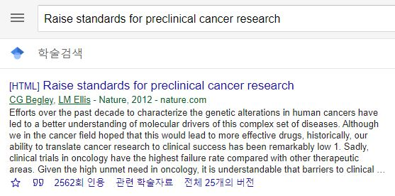
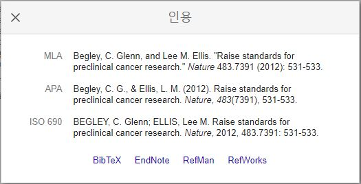

## Docker install

* Ubuntu server (192.168.122.155)에 docker install 

## Rstudio server container 

* 컨테이너 사용: https://hub.docker.com/r/rocker/rstudio

* 155 서버의 dockerimages/rocker-rstudio Dockerfile 설정

```{bash eval=F}
#!/bin/bash
sudo docker run -d --rm \
	-p 8787:8787 \
	-e PASSWORD=haseong \
	-v /home/haseong/alpha/:/alpha/ \
	--name rstudio-server \
	haseong/rocker-rstudio:v0.4
	#haseong/rstudio-server-run:v02


docker exec rstudio-server /bin/bash -c "cp -p /alpha/class/2021-1-researchE/shadow /etc/"
docker exec rstudio-server /bin/bash -c "cp -p /alpha/class/2021-1-researchE/gshadow /etc/"
docker exec rstudio-server /bin/bash -c "cp -p /alpha/class/2021-1-researchE/passwd /etc/"
docker exec rstudio-server /bin/bash -c "cp -p /alpha/class/2021-1-researchE/group /etc/"
```


## Rstudio user 설정

* 컨테이너 접속 

```{bash eval=F}
haseong@hs155:~/alpha/dockerimages/rocker-rstudio$ docker exec -it haseong/rocker-rstudio:v0.2 /bin/bash
```

* 사용자 추가 user01~user11, 디스크 저장 위해 마운트해준 홈디렉토리를 설정 

```{bash eval=F}
root@3e03bfbb6f3e:/ adduser user09 --home /alpha/class/2021-1-researchE/user09
```

* Rstudio 접속 확인: 브라우저에서 192.168.122.155:8787 접속, 주어진 사용자 ID Pass 사용 


## Shiny server 설정

* https://rstudio.com/products/shiny/download-server/ubuntu/
* https://github.com/rocker-org/shiny

## 사용자 파일 저장

컨테이너를 종료할 경우 홈디렉토리는 마운트한 위치에 그대로 유지되지만 추가한 사용자 정보는 더이상 유지되지 않음. 다음 컨테이너 재시작시 사용자 정보를 유지하기 위해서 다음 네 개의 파일을 마운트한 위치에 복사해 두고 다음에 시작할 때 이를 다시 /etc 위치로 복사함 (아래). 

```{bash eval=F}
root@26da26210a89:/ cd /etc/
root@26da26210a89:/ cp -p passwd group shadow gshadow /alpha/class/2021-1-researchE/

```


## 컨테이너 다시 시작 할 때 
```{bash eval=F}
haseong@hs155:~/alpha/dockerimages$ cd rocker-rstudio/

haseong@hs155:~/alpha/dockerimages/rocker-rstudio$ ll
total 24
drwxrwxr-x  2 haseong haseong 4096 Mar 13 14:15 ./
drwxrwxr-x 12 haseong haseong 4096 Mar 13 12:03 ../
-rwxrwxr-x  1 haseong haseong   75 Mar 13 11:45 docker_build.sh*
-rw-rw-r--  1 haseong haseong 1306 Mar 13 14:15 Dockerfile
-rw-rw-r--  1 haseong haseong  157 Mar 12 21:53 docker_run.bat
-rwxrwxr-x  1 haseong haseong  200 Mar 13 14:14 docker_run.sh*

haseong@hs155:~/alpha/dockerimages/rocker-rstudio$ ./docker_run.sh 
sudo: unable to resolve host hs155
ee31c7d53e9fcc517881cf7883fd396d33281396ed904d69b92204db0a0ca36c

haseong@hs155:~/alpha/dockerimages/rocker-rstudio$ docker exec -it rstudio-server /bin/bash

root@ee31c7d53e9f:/ cd /alpha/class/2021-1-researchE/

root@26da26210a89:/ cp -p passwd group shadow gshadow /etc/
```


## 사용중 Docker 이미지 저장

사용자들이 뭔가 설치하거나 바꿨을 경우 대부분 home 디렉토리에 바뀌지만 만약 변경사항 그대로를 이미지로 저장하고 다시 컨테이너를 시작할 수 있음. 해당 컨테이너에 대해서 (만약 컨테이너에 들어가 있으면 컨테이너에서 나온 후) commit 수행

```{bash eval=F}
root@3e03bfbb6f3e:/ exit

haseong@hs155:~/alpha/dockerimages/rocker-rstudio$ ll
total 24
drwxrwxr-x  2 haseong haseong 4096 Mar 13 13:09 ./
drwxrwxr-x 12 haseong haseong 4096 Mar 13 12:03 ../
-rwxrwxr-x  1 haseong haseong   75 Mar 13 11:45 docker_build.sh*
-rw-rw-r--  1 haseong haseong 1308 Mar 13 11:42 Dockerfile
-rw-rw-r--  1 haseong haseong  157 Mar 12 21:53 docker_run.bat
-rwxrwxr-x  1 haseong haseong  199 Mar 13 12:14 docker_run.sh*

haseong@hs155:~/alpha/dockerimages/rocker-rstudio$ docker ps -a
CONTAINER ID        IMAGE                         COMMAND             CREATED             STATUS              PORTS                                            NAMES
3e03bfbb6f3e        haseong/rocker-rstudio:v0.2   "/init"             About an hour ago   Up About an hour    0.0.0.0:3838->3838/tcp, 0.0.0.0:8787->8787/tcp   rstudio-server

haseong@hs155:~/alpha/dockerimages/rocker-rstudio$ docker commit rstudio-server haseong/rstudio-server-run:v02 
sha256:a05a062c8826f0fe48ea246fb9320805868ebbc4cc43b26c4ea5c29dc8582bd5

haseong@hs155:~/alpha/dockerimages/rocker-rstudio$ docker images
REPOSITORY                   TAG                 IMAGE ID            CREATED             SIZE
haseong/rstudio-server-run   v02                 a05a062c8826        6 seconds ago       2.92GB
haseong/rocker-rstudio       v0.2                26261869c025        About an hour ago   2.47GB
haseong/python-base          v0.1                cdb533348b32        15 hours ago        9.39GB
haseong/rocker-rstudio       v0.1                0dfea66561cb        15 hours ago        2.16GB
rocker/rstudio               4.0.4               1abc0fb419c9        7 days ago          1.95GB
ubuntu                       18.04               329ed837d508        9 days ago          63.3MB

```


# Rmarkdown
## citation

bibliographies 설명 [link](https://bookdown.org/yihui/rmarkdown-cookbook/bibliography.html). YAML에 `bibliography`와 `csl`을 명시함. 
```
title: "합성생물학의 재현성에 관한 연구"
subtitle: "2021년 1학기 UST 현장연구 E"
author: "합성생물학전문연구단 김하성"
output:
  html_document: 
    #theme: united
    #highlight: tango
    toc: true
    toc_depth: 1
    toc_float: true
    number_sections: true
    df_print: paged
    bibliography: bibliography.bib
    csl: acs-synthetic-biology.csl
```

bibliography는 [구글스칼라](https://scholar.google.co.kr/)에서 관련 논문을 검색 후 큰따옴표를 클릭한다



인용 창이 뜨면 BibTeX 링크를 클릭해서 나오는 정보를 복사해서 bibliography.bib 파일에 붙여넣는다. 



citation style [link](https://www.zotero.org/styles)


## 잡동사니

```{r eval=F}
dir.create("~/ShinyApps")
dir.create("~/ShinyApps/test")
file.copy(
  "~/test.html",
  "~/ShinyApps/test/index.html", recursive = TRUE
)
```
